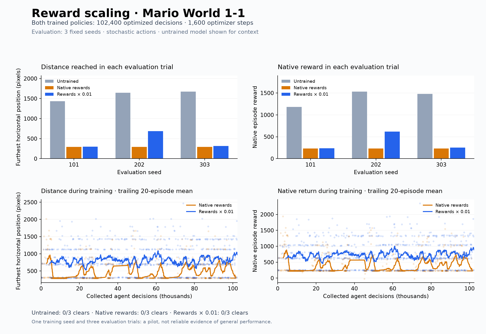
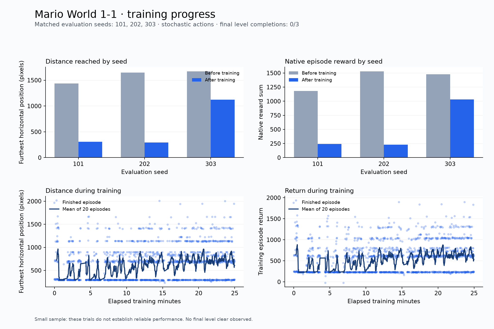
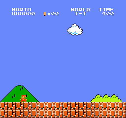
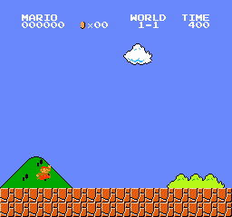

# Mario RL

Train a Super Mario Bros. World 1-1 agent with [gym-super-mario-bros](https://github.com/Kautenja/gym-super-mario-bros), Gymnasium, and Stable Baselines3.

## Score-focused training and the live window

The preserved completion model reached the flag in **100/100 fresh attempts** in the [September 20 comparison](results/teaching_20260920/README.md). The next experiment asks whether it can collect more actual game points while retaining reliable completion. Its original checkpoint stays unchanged.

The score objective is **score increase / 1,000 + 5 for finishing − 5 for a non-clearing episode end**. It replaces the native training reward; coins, distance, and power-ups do not receive additional hand-written bonuses. The usual five actions and saved policy are retained. These reward weights are an initial experiment, not a demonstrated optimum.

**Measurement boundary:** this emulator stops at flag touch, before the flag animation and remaining-time bonuses. Reports therefore measure **points earned before flag touch**, alongside completion rate. Native reward, game points, and the training reward are separate measurements. The five-action setup has no left, down, or stationary jump, so it cannot explore every possible scoring route.

Start a 15-minute pilot with the popup window and GitHub publication:

```sh
.venv/bin/python score_session.py --run-dir results/teaching_score_20260921 --minutes 15 --show-window --publish
```

This requires the preserved checkpoint at `results/teaching_20260920/training/03_stage/checkpoints/final.zip`. On another computer, download `03_stage.zip` from the [September 20 model release](https://github.com/sbardacosta-code/mario-rl/releases/tag/teaching_20260920) and use `--initial-model PATH`. A new run needs a new directory and unused seeds; `--seed-base` selects a different predeclared validation/test seed range. `--minutes 60` saves four 15-minute stages. Evaluation and uploads add time beyond training.

The session evaluates 20 fixed validation attempts at each stage, saves clips and checkpoints, then compares the baseline and a preselected candidate on 100 fresh attempts each. Candidate selection prioritizes actual points with failed attempts counted as zero, subject to a 19/20 validation completion threshold. A candidate that does not meet that threshold is labeled diagnostic and does not replace the baseline automatically.

To reopen the window without starting training:

Double-click `watch-training.command` in Finder to open the most recently created session, or select a specific session:

```sh
.venv/bin/python watch_training.py results/teaching_score_20260921
```

The **Live training** view samples the first of four training environments at up to five frames per second. It shows that frame's score, coins, position, and clock. The **Recorded checkpoints** view plays saved evaluation GIFs with Pause, Replay, and checkpoint selection. Captions distinguish live samples, inactive frames, and saved clips. Closing the popup never stops training. Create a `STOP` file inside the session folder to stop training gracefully and retain its checkpoint.

The viewer uses Tkinter and Pillow in the project's Python environment. macOS builds of Python must include Tk support. No game screen or model is uploaded by the live stream: its single overwritten frame file is local and Git-ignored. Saved evaluation clips are published only when the session uses `--publish`.

## Classroom project

[**Open the Mario learning gallery**](docs/aula/README.md) · [Teaching guide](docs/aula/GUIA_DOCENTE.md) · [Training and teaching plan](docs/aula/PLAN.md)

The lab preserves samples from every stage, comparable metrics, and action traces to discuss how a policy learns, where it fails, and when it regresses. The classroom link remains stable as new sessions are published. Access depends on the repository's permissions.

The teaching session uses blocks of approximately 15 minutes and five fixed evaluations per stage. Its parameters are a candidate configuration, not a demonstrated optimum. At the end, the model is evaluated with ten new seeds, and the session's checkpoints are backed up to GitHub Releases when publishing is enabled.

To prepare and run a new local session (up to three hours, with time reserved for evaluation and saving):

```sh
.venv/bin/python lesson_session.py --run-dir results/mi_clase --initial-model results/reward_scaled/checkpoints/final.zip --prepare-only
.venv/bin/python lesson_session.py --run-dir results/mi_clase --start-prepared --publish
```

The first command requires an existing local checkpoint. Each session has its own folder; previous results are not overwritten. `--publish` commits and pushes only that session's results and the classroom documents to `main`. To stop and save, create a `STOP` file in the session's results folder.

## Reward scaling pilot

The second experiment changed **only the training reward multiplier to 0.01**, restarting the exact original untrained checkpoint. It trained for **10.0 minutes**, using **102,400 decisions and 1,600 optimizer steps**. The comparison uses the original run's approximately 10-minute checkpoint, which has the same number of completed learning updates.

**The scaled agent traveled farther than the unscaled agent at the same update budget. It still fell short of the untrained network on these three trials. The scaled model cleared the level in 0 of 3 trials.**

| Three-trial evaluation | Untrained | Native rewards | Rewards × 0.01 |
| --- | ---: | ---: | ---: |
| Mean furthest position | 1,584.7 px | 296.0 px | 434.0 px |
| Mean native reward | 1,396.3 | 231.0 | 369.0 |
| Level completions | 0 / 3 | 0 / 3 | 0 / 3 |

The trained columns each represent 100 complete PPO rollouts and 400 epochs. The original archive has 102,796 collected decisions, including 396 not yet used in learning; its policy reflects 102,400 optimized decisions. The final scaled checkpoint was selected by the predefined budget. The original 25-minute final is retained below as a separate result, with a larger training budget.



[Experiment plan](results/reward_scaled/experiment_plan.json) · [Comparison data](results/reward_scaled/ab_comparison.json) · [Checkpoint verification](results/reward_scaled/verification.json) · [Scaled gameplay clip](results/reward_scaled/final/first-seed.gif)

The initial policy hash and first rollout match the original run. Saved weights are finite, changed during learning, and reload with the recorded policy hash and optimizer step count. Evaluation still uses native rewards and the same three stochastic seeds. This is a short pilot with one training seed, so the result does not establish reliable performance.

Reward scaling uses a [Gymnasium reward wrapper](https://gymnasium.farama.org/api/wrappers/reward_wrappers/) outside native episode accounting. `episodes.csv` and evaluation retain native rewards; SB3's `rollout/ep_rew_mean` logs scaled learning rewards. The [early diagnostics](results/reward_scaled/early_diagnostics.json) show smaller policy changes and retained action diversity at the early steps where the original run collapsed. That observation supports improved early stability; it does not prove the cause of the original failure. Value losses use different reward units and are not directly comparable quality scores.

Reproduce this pilot on the configured Mac in a new results directory:

```sh
.venv/bin/python scripts/check_reward_scaling.py
.venv/bin/python train.py --run-dir results/reward_scaled_repeat --resume results/first_training/checkpoints/initial.zip --reward-scale 0.01 --device cpu --threads 1 --n-envs 4 --seed 123 --max-timesteps 102400 --max-seconds 660
.venv/bin/python evaluate.py --model results/reward_scaled_repeat/checkpoints/final.zip --output-dir results/reward_scaled_repeat/final --seeds 101 202 303
```

The initial checkpoint is local. On a fresh checkout, create one in a new directory with `.venv/bin/python train.py --run-dir results/recreated_initial --initialize-only --threads 1`, then change the pilot command to use `--resume results/recreated_initial/checkpoints/initial.zip`. Regenerate the recorded comparison with `.venv/bin/python compare_reward_scaling.py --repo .`.

## First experiment: native rewards

The first experiment trained PPO for **25 minutes**, collecting **262,556 agent decisions** and completing **4,096 optimizer steps**. The final checkpoint was evaluated against its untrained initial network. **All three evaluation trials regressed; this run did not produce a better-playing agent.**

| Three-trial evaluation | Before | After |
| --- | ---: | ---: |
| Mean furthest horizontal position | 1,584.7 px | 575.7 px |
| Mean native episode reward | 1,396.3 | 501.7 |
| Level completions | 0 / 3 | 0 / 3 |


| Evaluation seed | Before: furthest position | After: furthest position |
| --- | ---: | ---: |
| 101 | 1,435 | 308 |
| 202 | 1,647 | 295 |
| 303 | 1,672 | 1,124 |

The timed run stopped automatically. 28 parameter tensors changed, all saved parameters are finite, and the checkpoint reloads with matching weights and optimizer step count. See [verification](results/first_training/verification.json). Of the collected decisions, 262,144 belonged to complete PPO rollouts; the final 412 were discarded when the time limit stopped collection.

See [comparison](results/first_training/comparison.json), [training summary](results/first_training/training_summary.json), and [configuration](results/first_training/config.json).



## Checkpoint evaluations

| Approximate training time | Decisions | Mean furthest position | Level clears |
| --- | ---: | ---: | ---: |
| 5 min | 52,228 | 296.0 | 0 / 3 |
| 10 min | 102,796 | 296.0 | 0 / 3 |
| 15 min | 156,392 | 683.3 | 0 / 3 |
| 20 min | 209,924 | 1,040.3 | 0 / 3 |
| 25 min (reported final) | 262,556 | 575.7 | 0 / 3 |

The earlier checkpoints show an initial collapse and partial recovery. We report the final time-budget checkpoint; no model was selected after looking at the final scores. All intermediate metrics and clips are retained in [intermediate](results/first_training/intermediate).

## Watch the result

| Untrained network | Final checkpoint |
| --- | --- |
|  |  |

These looping GIFs show the first 300 decisions, or the earlier episode end, of evaluation seed 101. One native RGB frame is recorded after each repeated action, played at an approximate rate because GIF frame timings are quantized. They are short excerpts; the JSON metrics cover complete trials. The baseline samples actions from an untrained PPO network.

## What learns

PPO uses `CnnPolicy`, four World 1-1 environments, training seed 123, and one CPU thread. The five `RIGHT_ONLY` actions are wait, right, right+jump, right+run, and right+run+jump. Each decision repeats for up to four emulator frames, stopping at episode end. Native rewards are summed across those frames. `--reward-scale` then multiplies rewards for learning only; it defaults to `1.0` and was `0.01` in the scaling pilot.

Inputs are four stacked 84 × 84 grayscale images: `uint8`, shape `(4, 84, 84)`. Episodes have a 3,000-decision limit. The current objective is increasing distance and eventually finishing World 1-1.

This is one training seed and three stochastic evaluation trials, using matched seeds 101, 202, and 303. Seeds vary sampled actions; they do not create new levels. These results cannot establish reliable completion or generalization. Each reported model is the final checkpoint chosen by its predefined training budget.

## Run locally

The configured Mac can use its existing `.venv` immediately. For a fresh checkout, first install native Python 3.13, then run:

```sh
python3.13 -m venv .venv
.venv/bin/python -m pip install -r requirements-lock.txt
.venv/bin/python -m pip check
.venv/bin/python mario_env.py
```

Start a fresh 25-minute experiment in a new directory:

```sh
.venv/bin/python train.py --run-dir results/next_training --max-seconds 1500 --device cpu --threads 1 --n-envs 4
```

Continue the scaled model, keeping its reward multiplier:

```sh
.venv/bin/python train.py --resume results/reward_scaled/checkpoints/final.zip --run-dir results/continued_training --reward-scale 0.01 --max-seconds 1500 --threads 1
```

Resume restores parameters and optimizer state; simulator state, partial rollouts, and random-number state are not restored exactly. Checkpoint ZIPs and detailed logs stay local and are Git-ignored. Cloning this repository does not download model weights.

Evaluate without learning and generate a replay GIF:

```sh
.venv/bin/python evaluate.py --model results/first_training/checkpoints/final.zip --output-dir results/replay --seeds 101 202 303
open results/replay/first-seed.gif
.venv/bin/python summarize.py --run-dir results/first_training
```

## Play manually

Double-click `play.command` in Finder or run `./play.command`. Focus the game window: **A/D** move, **O** jumps, **D+P** runs right, **Escape** quits. The launcher uses this repository's `.venv`.

## Next experiment

The scaling pilot improved distance against the matched unscaled checkpoint. A useful next test is a longer run with the same scaled configuration, followed by more evaluation trials and additional training seeds. This session stopped after the short pilot; no longer run has been started.
