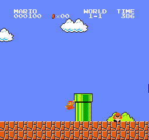

# Mario RL

Train a Super Mario Bros. agent with [gym-super-mario-bros](https://github.com/Kautenja/gym-super-mario-bros), Gymnasium, and Stable Baselines3.

**World 1-1 setup is verified on Apple Silicon macOS.** The repository now includes a keyboard-play launcher, reproducible dependencies, and an environment check with saved evidence. No model has been trained; the setup report records zero learning updates.

## Play on the configured Mac

Open `play.command` in Finder, or run it from this repository:

```sh
./play.command
```

Click the game window to focus it. Use **A / D** to move, **O** to jump, **D + P** to run right, and **Escape** to quit. The launcher uses the simple action set, so only its supported button combinations are active.

The launcher uses this repository's `.venv`; it does not need shell activation.

## Verified setup

| Component | Tested version |
| --- | --- |
| Python | 3.13.15, native ARM64 |
| gym-super-mario-bros | 9.1.0 |
| nes-py | 9.0.1 |
| Gymnasium | 1.3.0 |
| Stable Baselines3 | 2.9.0 |
| PyTorch | 2.14.0 |
| macOS | 26.6.2 |

[requirements.txt](requirements.txt) pins the direct dependencies. [requirements-lock.txt](requirements-lock.txt) records the full installed package set for this Python/macOS setup. The configured machine keeps Python in `.python/` and the virtual environment in `.venv/`; neither is committed.

## Check the environment again

```sh
.venv/bin/python -m pip check
MPLCONFIGDIR="$PWD/.cache/matplotlib" .venv/bin/python scripts/check_environment.py
```

The script checks the game without training and rewrites `results/setup/`. You can choose a different destination with `--output-dir`.

The saved [report](results/setup/report.json) confirms:

- World 1-1 produces nonblank 240 × 256 RGB images and exposes five `RIGHT_ONLY` actions.
- 1,000 random actions with seed 123 changed the image on 965 steps and reached horizontal position 594.
- Holding right without jumping caused death after 160 steps; the next reset succeeded.
- An external three-step time limit caused truncation; the next reset succeeded.
- Resized grayscale inputs stacked into four frames have shape `(4, 84, 84)` and passed Stable Baselines3's environment checker.

The screenshot below is from random play, not a trained model. These checks establish that the environment works; they do not measure learning ability or level completion.



## Recreate the environment

Use an installed native Python 3.13 interpreter:

```sh
git clone https://github.com/sbardacosta-code/mario-rl.git
cd mario-rl
python3.13 -m venv .venv
source .venv/bin/activate
python -m pip install --upgrade pip
python -m pip install -r requirements-lock.txt
python -m pip check
MPLCONFIGDIR="$PWD/.cache/matplotlib" python scripts/check_environment.py
./play.command
```

The [current Mario package requires Python 3.13 or newer](https://pypi.org/project/gym-super-mario-bros/). The package versions above were installed and checked on this Mac; other platforms should repeat the checks.

**Launcher correction:** the published 9.1.0 wheel does not contain `gym_super_mario_bros/__main__.py`, so its documented `python -m gym_super_mario_bros` command fails. Use the installed executable instead:

```sh
.venv/bin/gym_super_mario_bros --env SuperMarioBros-1-1-v0 --mode human --actionspace simple
```

For a quick built-in random-action demo:

```sh
.venv/bin/gym_super_mario_bros --env SuperMarioBros-1-1-v0 --mode random --actionspace right --steps 1000 --no-render --no-progress --seed 123
```

The built-in CLI seeds the environment but not action sampling. Use `scripts/check_environment.py` when you need the separately seeded random-action check used in the saved report.

## Next: build the learning experiment

1. Extract the checked image preprocessing into a reusable environment factory and add a validated action-repeat wrapper. The setup check currently advances one emulator frame per action.
2. Add PPO with `CnnPolicy`, initially using World 1-1 and `RIGHT_ONLY`. Run a short check of learning, logs, and checkpoint saving before increasing the budget.
3. Evaluate saved models separately using identical preprocessing and action mappings. Track distance, reward, and level completion rate; record videos.
4. Once World 1-1 is reliable, train and evaluate on more levels, including levels the agent has not trained on.

Planned additions: `src/mario_rl/env.py`, `train.py`, and `evaluate.py`. Model checkpoints, recordings, and logs are excluded from Git. See the [PPO documentation](https://stable-baselines3.readthedocs.io/en/master/modules/ppo.html) for the learning algorithm.
