# Mario aprende: laboratorio para el aula

Compará cómo cambia una política de aprendizaje por refuerzo entre etapas guardadas. El panel reúne mediciones, errores observables y clips del mismo nivel; los resultados pueden mejorar o empeorar.

**Sesión:** `teaching_20260916` · **Estado:** finalizada · **Actualizado:** 2026-09-16 10:04 UTC.

[Guía docente: clase de 35–45 minutos](GUIA_DOCENTE.md) · [Datos y configuración de esta sesión](../../results/teaching_20260916/manifest.json) · [Proyecto y experimentos anteriores](../../README.md)

Este panel mantiene la misma ruta `docs/aula/README.md` cuando se publican nuevas sesiones. Los reportes anteriores quedan en sus carpetas de resultados. GitHub muestra la última versión subida; no transmite el entrenamiento local en vivo. El acceso depende de los permisos del repositorio.

## Para mostrar en clase

1. Mirá la primera etapa y anotá una predicción.
2. Compará la misma semilla en otra etapa: primero el comienzo, después el tramo final.
3. Contrastá la impresión visual con las cinco pruebas, la posición máxima y la bandera.
4. Describí un error observable y una hipótesis; buscá evidencia para distinguirlas.

## Qué pasó hasta ahora

Entre la primera y la última etapa comparable, la posición máxima media **subió: 649,6 → 3.161,0 píxeles**. La última etapa alcanzó la bandera en **5 de 5 pruebas**. Es una descripción de estas pruebas del mismo nivel; no demuestra desempeño general ni mejora estable.

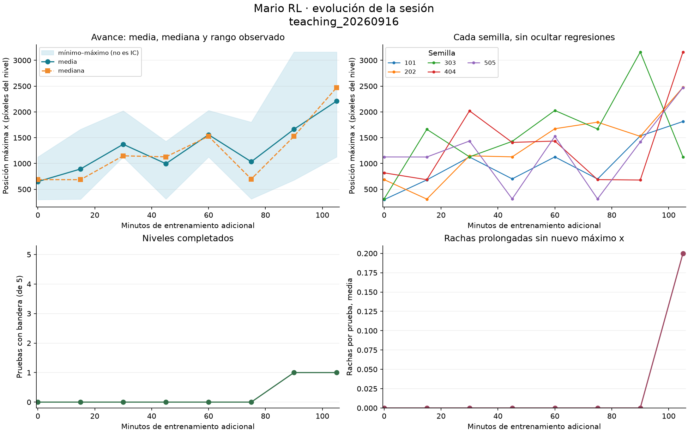

El eje horizontal mide entrenamiento **adicional de esta sesión**. Las decisiones de la tabla son acumuladas y pueden incluir entrenamiento previo. La banda muestra el mínimo y máximo de las pruebas; no es un intervalo de confianza. La posición x es una coordenada del nivel, no un porcentaje completado.

| Etapa | Minutos adicionales | Decisiones acumuladas | Media x | Mediana x | Mín.–máx. x | Bandera |
| --- | ---: | ---: | ---: | ---: | ---: | ---: |
| Inicio: modelo con 102,400 decisiones previas | 0,0 | 102.400 | 649,6 | 688,0 | 300–1.127 | 0/5 |
| Etapa 1: 15 min adicionales | 15,0 | 262.500 | 893,4 | 686,0 | 310–1.663 | 0/5 |
| Etapa 2: 30 min adicionales | 30,0 | 414.928 | 1.372,2 | 1.149,0 | 1.126–2.021 | 0/5 |
| Etapa 3: 45 min adicionales | 45,0 | 570.580 | 996,6 | 1.129,0 | 314–1.429 | 0/5 |
| Etapa 4: 60 min adicionales | 60,0 | 731.768 | 1.558,4 | 1.527,0 | 1.128–2.028 | 0/5 |
| Etapa 5: 75 min adicionales | 75,0 | 897.056 | 1.034,2 | 699,0 | 314–1.801 | 0/5 |
| Etapa 6: 90 min adicionales | 90,0 | 1.060.900 | 1.663,8 | 1.526,0 | 680–3.161 | 1/5 |
| Etapa 7: 105 min adicionales | 105,0 | 1.226.324 | 2.210,6 | 2.473,0 | 1.129–3.161 | 1/5 |
| Etapa 8: 120 min adicionales | 120,0 | 1.387.392 | 2.806,4 | 2.762,0 | 2.473–3.161 | 2/5 |
| Etapa 9: 135 min adicionales | 135,0 | 1.547.240 | 3.081,2 | 3.161,0 | 2.762–3.161 | 4/5 |
| Etapa 10: 150 min adicionales | 150,0 | 1.708.772 | 3.161,0 | 3.161,0 | 3.161–3.161 | 5/5 |
| Etapa 11: 163 min adicionales | 162,8 | 1.846.520 | 3.161,0 | 3.161,0 | 3.161–3.161 | 5/5 |

| Etapa | Recompensa nativa media | Rachas sin progreso | Pruebas con alguna racha |
| --- | ---: | ---: | ---: |
| Inicio: modelo con 102,400 decisiones previas | 575,8 | 0 | 0/5 |
| Etapa 1: 15 min adicionales | 812,0 | 0 | 0/5 |
| Etapa 2: 30 min adicionales | 1.290,4 | 0 | 0/5 |
| Etapa 3: 45 min adicionales | 916,0 | 0 | 0/5 |
| Etapa 4: 60 min adicionales | 1.469,2 | 0 | 0/5 |
| Etapa 5: 75 min adicionales | 956,8 | 0 | 0/5 |
| Etapa 6: 90 min adicionales | 1.583,0 | 0 | 0/5 |
| Etapa 7: 105 min adicionales | 2.109,6 | 1 | 1/5 |
| Etapa 8: 120 min adicionales | 2.714,6 | 0 | 0/5 |
| Etapa 9: 135 min adicionales | 2.999,6 | 0 | 0/5 |
| Etapa 10: 150 min adicionales | 3.086,6 | 0 | 0/5 |
| Etapa 11: 163 min adicionales | 3.088,0 | 0 | 0/5 |

## Cómo se midió

Semillas previstas: **101, 202, 303, 404, 505**. El muestreo se reinicia para cada prueba; las semillas cambian las acciones muestreadas en World 1-1, no el diseño del nivel. La evaluación usa pesos congelados y recompensa nativa. La configuración de aprendizaje registrada es:

| Parámetro | Valor |
| --- | --- |
| Multiplicador de recompensa al entrenar | `0.01` |
| Tasa de aprendizaje | `0.0001` |
| Umbral KL objetivo | `0.02` |
| Coeficiente de entropía | `0.01` |
| Semilla de entrenamiento | `123` |
| Segundos previstos por etapa | `900` |

Modo de evaluación: **estocástico (acciones muestreadas)**. Límite por intento: **3.000 decisiones**. Una racha se registra al pasar **120 decisiones sin aumentar el máximo x previo**, según el protocolo. Puede incluir saltos o movimiento dentro de una zona ya recorrida; no detecta automáticamente paredes ni la causa de una muerte.

Se muestran todas las etapas registradas, incluidas las regresiones. Los promedios excluyen evaluaciones incompletas o con protocolo distinto. Un intento parcial, si existe, queda documentado en su JSON. Si se eligió una etapa para demostrarla, esa selección se etiqueta y no sustituye la última etapa.

Los clips son extractos del comienzo y del final de cada prueba grabada; pueden solaparse en episodios cortos. No todas las semillas necesitan tener video: cada fila conserva su traza y las métricas. Las duraciones y los límites de captura exactos están en `evaluation.json`.

## Etapas y evidencia

### Inicio: modelo con 102,400 decisiones previas

Etapa `00_baseline` · 0,0 minutos adicionales · 102.400 decisiones acumuladas.

[Evaluación completa en JSON](../../results/teaching_20260916/stages/00_baseline/evaluation.json)

| Semilla | Máx. x | Última x | Recompensa nativa | Final del intento | Rachas | Mayor racha (decisiones) | Evidencia |
| ---: | ---: | ---: | ---: | --- | ---: | ---: | --- |
| 101 | 300 | 300 | 236,0 | fin sin bandera; causa no identificada | 0 | 1 | [comienzo](../../results/teaching_20260916/stages/00_baseline/seed-101/beginning.gif) · [tramo final](../../results/teaching_20260916/stages/00_baseline/seed-101/ending.gif) · [traza CSV](../../results/teaching_20260916/stages/00_baseline/seed-101/trace.csv) · [último fotograma](../../results/teaching_20260916/stages/00_baseline/seed-101/last-frame.png) |
| 202 | 688 | 688 | 620,0 | fin sin bandera; causa no identificada | 0 | 10 | [comienzo](../../results/teaching_20260916/stages/00_baseline/seed-202/beginning.gif) · [tramo final](../../results/teaching_20260916/stages/00_baseline/seed-202/ending.gif) · [traza CSV](../../results/teaching_20260916/stages/00_baseline/seed-202/trace.csv) · [último fotograma](../../results/teaching_20260916/stages/00_baseline/seed-202/last-frame.png) |
| 303 | 314 | 314 | 251,0 | fin sin bandera; causa no identificada | 0 | 1 | [comienzo](../../results/teaching_20260916/stages/00_baseline/seed-303/beginning.gif) · [tramo final](../../results/teaching_20260916/stages/00_baseline/seed-303/ending.gif) · [traza CSV](../../results/teaching_20260916/stages/00_baseline/seed-303/trace.csv) · [último fotograma](../../results/teaching_20260916/stages/00_baseline/seed-303/last-frame.png) |
| 404 | 819 | 819 | 730,0 | fin sin bandera; causa no identificada | 0 | 78 | [traza CSV](../../results/teaching_20260916/stages/00_baseline/seed-404/trace.csv) |
| 505 | 1.127 | 1.127 | 1.042,0 | fin sin bandera; causa no identificada | 0 | 31 | [traza CSV](../../results/teaching_20260916/stages/00_baseline/seed-505/trace.csv) |

| Comienzo, semilla 101, decisiones 1–36 | Tramo final, semilla 101, decisiones 1–36 |
| --- | --- |
|  | 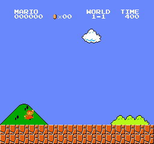 |

**Para discutir:** ¿qué se observa al terminar este intento? ¿Qué evidencia distingue un salto tardío, una repetición de acciones o un límite de decisiones? La causa específica requiere revisar los clips; la posición por sí sola no la identifica.

### Etapa 1: 15 min adicionales

Etapa `01_stage` · 15,0 minutos adicionales · 262.500 decisiones acumuladas.

[Evaluación completa en JSON](../../results/teaching_20260916/stages/01_stage/evaluation.json) · [Resumen del entrenamiento](../../results/teaching_20260916/training/01_stage/training_summary.json)

| Semilla | Máx. x | Última x | Recompensa nativa | Final del intento | Rachas | Mayor racha (decisiones) | Evidencia |
| ---: | ---: | ---: | ---: | --- | ---: | ---: | --- |
| 101 | 682 | 682 | 606,0 | fin sin bandera; causa no identificada | 0 | 22 | [comienzo](../../results/teaching_20260916/stages/01_stage/seed-101/beginning.gif) · [tramo final](../../results/teaching_20260916/stages/01_stage/seed-101/ending.gif) · [traza CSV](../../results/teaching_20260916/stages/01_stage/seed-101/trace.csv) · [último fotograma](../../results/teaching_20260916/stages/01_stage/seed-101/last-frame.png) |
| 202 | 310 | 310 | 254,0 | fin sin bandera; causa no identificada | 0 | 1 | [comienzo](../../results/teaching_20260916/stages/01_stage/seed-202/beginning.gif) · [tramo final](../../results/teaching_20260916/stages/01_stage/seed-202/ending.gif) · [traza CSV](../../results/teaching_20260916/stages/01_stage/seed-202/trace.csv) · [último fotograma](../../results/teaching_20260916/stages/01_stage/seed-202/last-frame.png) |
| 303 | 1.663 | 1.663 | 1.556,0 | fin sin bandera; causa no identificada | 0 | 49 | [comienzo](../../results/teaching_20260916/stages/01_stage/seed-303/beginning.gif) · [tramo final](../../results/teaching_20260916/stages/01_stage/seed-303/ending.gif) · [traza CSV](../../results/teaching_20260916/stages/01_stage/seed-303/trace.csv) · [último fotograma](../../results/teaching_20260916/stages/01_stage/seed-303/last-frame.png) |
| 404 | 686 | 686 | 613,0 | fin sin bandera; causa no identificada | 0 | 16 | [traza CSV](../../results/teaching_20260916/stages/01_stage/seed-404/trace.csv) |
| 505 | 1.126 | 1.126 | 1.031,0 | fin sin bandera; causa no identificada | 0 | 40 | [traza CSV](../../results/teaching_20260916/stages/01_stage/seed-505/trace.csv) |

| Comienzo, semilla 101, decisiones 1–93 | Tramo final, semilla 101, decisiones 19–93 |
| --- | --- |
| 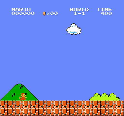 | 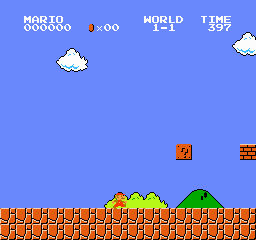 |

**Para discutir:** ¿qué se observa al terminar este intento? ¿Qué evidencia distingue un salto tardío, una repetición de acciones o un límite de decisiones? La causa específica requiere revisar los clips; la posición por sí sola no la identifica.

### Etapa 2: 30 min adicionales

Etapa `02_stage` · 30,0 minutos adicionales · 414.928 decisiones acumuladas.

[Evaluación completa en JSON](../../results/teaching_20260916/stages/02_stage/evaluation.json) · [Resumen del entrenamiento](../../results/teaching_20260916/training/02_stage/training_summary.json)

| Semilla | Máx. x | Última x | Recompensa nativa | Final del intento | Rachas | Mayor racha (decisiones) | Evidencia |
| ---: | ---: | ---: | ---: | --- | ---: | ---: | --- |
| 101 | 1.126 | 1.126 | 1.051,0 | fin sin bandera; causa no identificada | 0 | 5 | [comienzo](../../results/teaching_20260916/stages/02_stage/seed-101/beginning.gif) · [tramo final](../../results/teaching_20260916/stages/02_stage/seed-101/ending.gif) · [traza CSV](../../results/teaching_20260916/stages/02_stage/seed-101/trace.csv) · [último fotograma](../../results/teaching_20260916/stages/02_stage/seed-101/last-frame.png) |
| 202 | 1.149 | 1.149 | 1.065,0 | fin sin bandera; causa no identificada | 0 | 13 | [comienzo](../../results/teaching_20260916/stages/02_stage/seed-202/beginning.gif) · [tramo final](../../results/teaching_20260916/stages/02_stage/seed-202/ending.gif) · [traza CSV](../../results/teaching_20260916/stages/02_stage/seed-202/trace.csv) · [último fotograma](../../results/teaching_20260916/stages/02_stage/seed-202/last-frame.png) |
| 303 | 1.129 | 1.129 | 1.051,0 | fin sin bandera; causa no identificada | 0 | 16 | [comienzo](../../results/teaching_20260916/stages/02_stage/seed-303/beginning.gif) · [tramo final](../../results/teaching_20260916/stages/02_stage/seed-303/ending.gif) · [traza CSV](../../results/teaching_20260916/stages/02_stage/seed-303/trace.csv) · [último fotograma](../../results/teaching_20260916/stages/02_stage/seed-303/last-frame.png) |
| 404 | 2.021 | 2.021 | 1.943,0 | fin sin bandera; causa no identificada | 0 | 5 | [traza CSV](../../results/teaching_20260916/stages/02_stage/seed-404/trace.csv) |
| 505 | 1.436 | 1.436 | 1.342,0 | fin sin bandera; causa no identificada | 0 | 20 | [traza CSV](../../results/teaching_20260916/stages/02_stage/seed-505/trace.csv) |

| Comienzo, semilla 101, decisiones 1–148 | Tramo final, semilla 101, decisiones 74–148 |
| --- | --- |
|  | 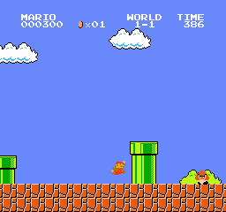 |

**Para discutir:** ¿qué se observa al terminar este intento? ¿Qué evidencia distingue un salto tardío, una repetición de acciones o un límite de decisiones? La causa específica requiere revisar los clips; la posición por sí sola no la identifica.

### Etapa 3: 45 min adicionales

Etapa `03_stage` · 45,0 minutos adicionales · 570.580 decisiones acumuladas.

[Evaluación completa en JSON](../../results/teaching_20260916/stages/03_stage/evaluation.json) · [Resumen del entrenamiento](../../results/teaching_20260916/training/03_stage/training_summary.json)

| Semilla | Máx. x | Última x | Recompensa nativa | Final del intento | Rachas | Mayor racha (decisiones) | Evidencia |
| ---: | ---: | ---: | ---: | --- | ---: | ---: | --- |
| 101 | 702 | 702 | 628,0 | fin sin bandera; causa no identificada | 0 | 4 | [comienzo](../../results/teaching_20260916/stages/03_stage/seed-101/beginning.gif) · [tramo final](../../results/teaching_20260916/stages/03_stage/seed-101/ending.gif) · [traza CSV](../../results/teaching_20260916/stages/03_stage/seed-101/trace.csv) · [último fotograma](../../results/teaching_20260916/stages/03_stage/seed-101/last-frame.png) |
| 202 | 1.129 | 1.129 | 1.041,0 | fin sin bandera; causa no identificada | 0 | 31 | [comienzo](../../results/teaching_20260916/stages/03_stage/seed-202/beginning.gif) · [tramo final](../../results/teaching_20260916/stages/03_stage/seed-202/ending.gif) · [traza CSV](../../results/teaching_20260916/stages/03_stage/seed-202/trace.csv) · [último fotograma](../../results/teaching_20260916/stages/03_stage/seed-202/last-frame.png) |
| 303 | 1.429 | 1.429 | 1.339,0 | fin sin bandera; causa no identificada | 0 | 17 | [comienzo](../../results/teaching_20260916/stages/03_stage/seed-303/beginning.gif) · [tramo final](../../results/teaching_20260916/stages/03_stage/seed-303/ending.gif) · [traza CSV](../../results/teaching_20260916/stages/03_stage/seed-303/trace.csv) · [último fotograma](../../results/teaching_20260916/stages/03_stage/seed-303/last-frame.png) |
| 404 | 1.409 | 1.409 | 1.322,0 | fin sin bandera; causa no identificada | 0 | 18 | [traza CSV](../../results/teaching_20260916/stages/03_stage/seed-404/trace.csv) |
| 505 | 314 | 314 | 250,0 | fin sin bandera; causa no identificada | 0 | 1 | [traza CSV](../../results/teaching_20260916/stages/03_stage/seed-505/trace.csv) |

| Comienzo, semilla 101, decisiones 1–86 | Tramo final, semilla 101, decisiones 12–86 |
| --- | --- |
|  | 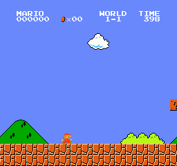 |

**Para discutir:** ¿qué se observa al terminar este intento? ¿Qué evidencia distingue un salto tardío, una repetición de acciones o un límite de decisiones? La causa específica requiere revisar los clips; la posición por sí sola no la identifica.

### Etapa 4: 60 min adicionales

Etapa `04_stage` · 60,0 minutos adicionales · 731.768 decisiones acumuladas.

[Evaluación completa en JSON](../../results/teaching_20260916/stages/04_stage/evaluation.json) · [Resumen del entrenamiento](../../results/teaching_20260916/training/04_stage/training_summary.json)

| Semilla | Máx. x | Última x | Recompensa nativa | Final del intento | Rachas | Mayor racha (decisiones) | Evidencia |
| ---: | ---: | ---: | ---: | --- | ---: | ---: | --- |
| 101 | 1.128 | 1.128 | 1.049,0 | fin sin bandera; causa no identificada | 0 | 28 | [comienzo](../../results/teaching_20260916/stages/04_stage/seed-101/beginning.gif) · [tramo final](../../results/teaching_20260916/stages/04_stage/seed-101/ending.gif) · [traza CSV](../../results/teaching_20260916/stages/04_stage/seed-101/trace.csv) · [último fotograma](../../results/teaching_20260916/stages/04_stage/seed-101/last-frame.png) |
| 202 | 1.674 | 1.674 | 1.573,0 | fin sin bandera; causa no identificada | 0 | 31 | [comienzo](../../results/teaching_20260916/stages/04_stage/seed-202/beginning.gif) · [tramo final](../../results/teaching_20260916/stages/04_stage/seed-202/ending.gif) · [traza CSV](../../results/teaching_20260916/stages/04_stage/seed-202/trace.csv) · [último fotograma](../../results/teaching_20260916/stages/04_stage/seed-202/last-frame.png) |
| 303 | 2.028 | 2.028 | 1.930,0 | fin sin bandera; causa no identificada | 0 | 16 | [comienzo](../../results/teaching_20260916/stages/04_stage/seed-303/beginning.gif) · [tramo final](../../results/teaching_20260916/stages/04_stage/seed-303/ending.gif) · [traza CSV](../../results/teaching_20260916/stages/04_stage/seed-303/trace.csv) · [último fotograma](../../results/teaching_20260916/stages/04_stage/seed-303/last-frame.png) |
| 404 | 1.435 | 1.435 | 1.354,0 | fin sin bandera; causa no identificada | 0 | 23 | [traza CSV](../../results/teaching_20260916/stages/04_stage/seed-404/trace.csv) |
| 505 | 1.527 | 1.527 | 1.440,0 | fin sin bandera; causa no identificada | 0 | 33 | [traza CSV](../../results/teaching_20260916/stages/04_stage/seed-505/trace.csv) |

| Comienzo, semilla 101, decisiones 1–150 | Tramo final, semilla 101, decisiones 87–161 |
| --- | --- |
|  | 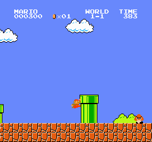 |

**Para discutir:** ¿qué se observa al terminar este intento? ¿Qué evidencia distingue un salto tardío, una repetición de acciones o un límite de decisiones? La causa específica requiere revisar los clips; la posición por sí sola no la identifica.

### Etapa 5: 75 min adicionales

Etapa `05_stage` · 75,0 minutos adicionales · 897.056 decisiones acumuladas.

[Evaluación completa en JSON](../../results/teaching_20260916/stages/05_stage/evaluation.json) · [Resumen del entrenamiento](../../results/teaching_20260916/training/05_stage/training_summary.json)

| Semilla | Máx. x | Última x | Recompensa nativa | Final del intento | Rachas | Mayor racha (decisiones) | Evidencia |
| ---: | ---: | ---: | ---: | --- | ---: | ---: | --- |
| 101 | 699 | 699 | 636,0 | fin sin bandera; causa no identificada | 0 | 2 | [comienzo](../../results/teaching_20260916/stages/05_stage/seed-101/beginning.gif) · [tramo final](../../results/teaching_20260916/stages/05_stage/seed-101/ending.gif) · [traza CSV](../../results/teaching_20260916/stages/05_stage/seed-101/trace.csv) · [último fotograma](../../results/teaching_20260916/stages/05_stage/seed-101/last-frame.png) |
| 202 | 1.801 | 1.801 | 1.707,0 | fin sin bandera; causa no identificada | 0 | 15 | [comienzo](../../results/teaching_20260916/stages/05_stage/seed-202/beginning.gif) · [tramo final](../../results/teaching_20260916/stages/05_stage/seed-202/ending.gif) · [traza CSV](../../results/teaching_20260916/stages/05_stage/seed-202/trace.csv) · [último fotograma](../../results/teaching_20260916/stages/05_stage/seed-202/last-frame.png) |
| 303 | 1.669 | 1.669 | 1.572,0 | fin sin bandera; causa no identificada | 0 | 18 | [comienzo](../../results/teaching_20260916/stages/05_stage/seed-303/beginning.gif) · [tramo final](../../results/teaching_20260916/stages/05_stage/seed-303/ending.gif) · [traza CSV](../../results/teaching_20260916/stages/05_stage/seed-303/trace.csv) · [último fotograma](../../results/teaching_20260916/stages/05_stage/seed-303/last-frame.png) |
| 404 | 688 | 688 | 618,0 | fin sin bandera; causa no identificada | 0 | 13 | [traza CSV](../../results/teaching_20260916/stages/05_stage/seed-404/trace.csv) |
| 505 | 314 | 314 | 251,0 | fin sin bandera; causa no identificada | 0 | 1 | [traza CSV](../../results/teaching_20260916/stages/05_stage/seed-505/trace.csv) |

| Comienzo, semilla 101, decisiones 1–73 | Tramo final, semilla 101, decisiones 1–73 |
| --- | --- |
|  |  |

**Para discutir:** ¿qué se observa al terminar este intento? ¿Qué evidencia distingue un salto tardío, una repetición de acciones o un límite de decisiones? La causa específica requiere revisar los clips; la posición por sí sola no la identifica.

### Etapa 6: 90 min adicionales

Etapa `06_stage` · 90,0 minutos adicionales · 1.060.900 decisiones acumuladas.

[Evaluación completa en JSON](../../results/teaching_20260916/stages/06_stage/evaluation.json) · [Resumen del entrenamiento](../../results/teaching_20260916/training/06_stage/training_summary.json)

| Semilla | Máx. x | Última x | Recompensa nativa | Final del intento | Rachas | Mayor racha (decisiones) | Evidencia |
| ---: | ---: | ---: | ---: | --- | ---: | ---: | --- |
| 101 | 1.534 | 1.534 | 1.453,0 | fin sin bandera; causa no identificada | 0 | 9 | [comienzo](../../results/teaching_20260916/stages/06_stage/seed-101/beginning.gif) · [tramo final](../../results/teaching_20260916/stages/06_stage/seed-101/ending.gif) · [traza CSV](../../results/teaching_20260916/stages/06_stage/seed-101/trace.csv) · [último fotograma](../../results/teaching_20260916/stages/06_stage/seed-101/last-frame.png) |
| 202 | 1.526 | 1.526 | 1.441,0 | fin sin bandera; causa no identificada | 0 | 18 | [comienzo](../../results/teaching_20260916/stages/06_stage/seed-202/beginning.gif) · [tramo final](../../results/teaching_20260916/stages/06_stage/seed-202/ending.gif) · [traza CSV](../../results/teaching_20260916/stages/06_stage/seed-202/trace.csv) · [último fotograma](../../results/teaching_20260916/stages/06_stage/seed-202/last-frame.png) |
| 303 | 3.161 | 3.161 | 3.075,0 | bandera alcanzada | 0 | 14 | [comienzo](../../results/teaching_20260916/stages/06_stage/seed-303/beginning.gif) · [tramo final](../../results/teaching_20260916/stages/06_stage/seed-303/ending.gif) · [traza CSV](../../results/teaching_20260916/stages/06_stage/seed-303/trace.csv) · [último fotograma](../../results/teaching_20260916/stages/06_stage/seed-303/last-frame.png) |
| 404 | 680 | 680 | 610,0 | fin sin bandera; causa no identificada | 0 | 1 | [traza CSV](../../results/teaching_20260916/stages/06_stage/seed-404/trace.csv) |
| 505 | 1.418 | 1.418 | 1.336,0 | fin sin bandera; causa no identificada | 0 | 11 | [traza CSV](../../results/teaching_20260916/stages/06_stage/seed-505/trace.csv) |

| Comienzo, semilla 101, decisiones 1–150 | Tramo final, semilla 101, decisiones 88–162 |
| --- | --- |
|  | 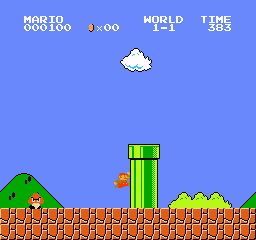 |

**Para discutir:** ¿qué se observa al terminar este intento? ¿Qué evidencia distingue un salto tardío, una repetición de acciones o un límite de decisiones? La causa específica requiere revisar los clips; la posición por sí sola no la identifica.

### Etapa 7: 105 min adicionales

Etapa `07_stage` · 105,0 minutos adicionales · 1.226.324 decisiones acumuladas.

[Evaluación completa en JSON](../../results/teaching_20260916/stages/07_stage/evaluation.json) · [Resumen del entrenamiento](../../results/teaching_20260916/training/07_stage/training_summary.json)

| Semilla | Máx. x | Última x | Recompensa nativa | Final del intento | Rachas | Mayor racha (decisiones) | Evidencia |
| ---: | ---: | ---: | ---: | --- | ---: | ---: | --- |
| 101 | 1.814 | 1.814 | 1.724,0 | fin sin bandera; causa no identificada | 0 | 26 | [comienzo](../../results/teaching_20260916/stages/07_stage/seed-101/beginning.gif) · [tramo final](../../results/teaching_20260916/stages/07_stage/seed-101/ending.gif) · [traza CSV](../../results/teaching_20260916/stages/07_stage/seed-101/trace.csv) · [último fotograma](../../results/teaching_20260916/stages/07_stage/seed-101/last-frame.png) |
| 202 | 2.476 | 2.476 | 2.366,0 | fin sin bandera; causa no identificada | 0 | 16 | [comienzo](../../results/teaching_20260916/stages/07_stage/seed-202/beginning.gif) · [tramo final](../../results/teaching_20260916/stages/07_stage/seed-202/ending.gif) · [traza CSV](../../results/teaching_20260916/stages/07_stage/seed-202/trace.csv) · [último fotograma](../../results/teaching_20260916/stages/07_stage/seed-202/last-frame.png) |
| 303 | 1.129 | 1.129 | 1.015,0 | fin sin bandera; causa no identificada | 1 | 173 | [comienzo](../../results/teaching_20260916/stages/07_stage/seed-303/beginning.gif) · [tramo final](../../results/teaching_20260916/stages/07_stage/seed-303/ending.gif) · [traza CSV](../../results/teaching_20260916/stages/07_stage/seed-303/trace.csv) · [último fotograma](../../results/teaching_20260916/stages/07_stage/seed-303/last-frame.png) |
| 404 | 3.161 | 3.161 | 3.054,0 | bandera alcanzada | 0 | 19 | [traza CSV](../../results/teaching_20260916/stages/07_stage/seed-404/trace.csv) |
| 505 | 2.473 | 2.473 | 2.389,0 | fin sin bandera; causa no identificada | 0 | 5 | [traza CSV](../../results/teaching_20260916/stages/07_stage/seed-505/trace.csv) |

| Comienzo, semilla 101, decisiones 1–150 | Tramo final, semilla 101, decisiones 130–204 |
| --- | --- |
|  | 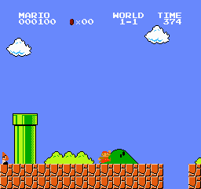 |

**Para discutir:** ¿qué se observa al terminar este intento? ¿Qué evidencia distingue un salto tardío, una repetición de acciones o un límite de decisiones? La causa específica requiere revisar los clips; la posición por sí sola no la identifica.

### Etapa 8: 120 min adicionales

Etapa `08_stage` · 120,0 minutos adicionales · 1.387.392 decisiones acumuladas.

[Evaluación completa en JSON](../../results/teaching_20260916/stages/08_stage/evaluation.json) · [Resumen del entrenamiento](../../results/teaching_20260916/training/08_stage/training_summary.json)

| Semilla | Máx. x | Última x | Recompensa nativa | Final del intento | Rachas | Mayor racha (decisiones) | Evidencia |
| ---: | ---: | ---: | ---: | --- | ---: | ---: | --- |
| 101 | 2.473 | 2.473 | 2.379,0 | fin sin bandera; causa no identificada | 0 | 6 | [comienzo](../../results/teaching_20260916/stages/08_stage/seed-101/beginning.gif) · [tramo final](../../results/teaching_20260916/stages/08_stage/seed-101/ending.gif) · [traza CSV](../../results/teaching_20260916/stages/08_stage/seed-101/trace.csv) · [último fotograma](../../results/teaching_20260916/stages/08_stage/seed-101/last-frame.png) |
| 202 | 2.762 | 2.762 | 2.659,0 | fin sin bandera; causa no identificada | 0 | 22 | [comienzo](../../results/teaching_20260916/stages/08_stage/seed-202/beginning.gif) · [tramo final](../../results/teaching_20260916/stages/08_stage/seed-202/ending.gif) · [traza CSV](../../results/teaching_20260916/stages/08_stage/seed-202/trace.csv) · [último fotograma](../../results/teaching_20260916/stages/08_stage/seed-202/last-frame.png) |
| 303 | 2.475 | 2.475 | 2.380,0 | fin sin bandera; causa no identificada | 0 | 7 | [comienzo](../../results/teaching_20260916/stages/08_stage/seed-303/beginning.gif) · [tramo final](../../results/teaching_20260916/stages/08_stage/seed-303/ending.gif) · [traza CSV](../../results/teaching_20260916/stages/08_stage/seed-303/trace.csv) · [último fotograma](../../results/teaching_20260916/stages/08_stage/seed-303/last-frame.png) |
| 404 | 3.161 | 3.161 | 3.076,0 | bandera alcanzada | 0 | 10 | [traza CSV](../../results/teaching_20260916/stages/08_stage/seed-404/trace.csv) |
| 505 | 3.161 | 3.161 | 3.079,0 | bandera alcanzada | 0 | 5 | [traza CSV](../../results/teaching_20260916/stages/08_stage/seed-505/trace.csv) |

| Comienzo, semilla 101, decisiones 1–150 | Tramo final, semilla 101, decisiones 168–242 |
| --- | --- |
|  | 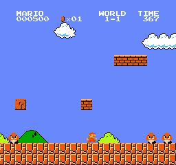 |

**Para discutir:** ¿qué se observa al terminar este intento? ¿Qué evidencia distingue un salto tardío, una repetición de acciones o un límite de decisiones? La causa específica requiere revisar los clips; la posición por sí sola no la identifica.

### Etapa 9: 135 min adicionales

Etapa `09_stage` · 135,0 minutos adicionales · 1.547.240 decisiones acumuladas.

[Evaluación completa en JSON](../../results/teaching_20260916/stages/09_stage/evaluation.json) · [Resumen del entrenamiento](../../results/teaching_20260916/training/09_stage/training_summary.json)

| Semilla | Máx. x | Última x | Recompensa nativa | Final del intento | Rachas | Mayor racha (decisiones) | Evidencia |
| ---: | ---: | ---: | ---: | --- | ---: | ---: | --- |
| 101 | 3.161 | 3.161 | 3.077,0 | bandera alcanzada | 0 | 12 | [comienzo](../../results/teaching_20260916/stages/09_stage/seed-101/beginning.gif) · [tramo final](../../results/teaching_20260916/stages/09_stage/seed-101/ending.gif) · [traza CSV](../../results/teaching_20260916/stages/09_stage/seed-101/trace.csv) · [último fotograma](../../results/teaching_20260916/stages/09_stage/seed-101/last-frame.png) |
| 202 | 3.161 | 3.161 | 3.077,0 | bandera alcanzada | 0 | 19 | [comienzo](../../results/teaching_20260916/stages/09_stage/seed-202/beginning.gif) · [tramo final](../../results/teaching_20260916/stages/09_stage/seed-202/ending.gif) · [traza CSV](../../results/teaching_20260916/stages/09_stage/seed-202/trace.csv) · [último fotograma](../../results/teaching_20260916/stages/09_stage/seed-202/last-frame.png) |
| 303 | 2.762 | 2.762 | 2.675,0 | fin sin bandera; causa no identificada | 0 | 1 | [comienzo](../../results/teaching_20260916/stages/09_stage/seed-303/beginning.gif) · [tramo final](../../results/teaching_20260916/stages/09_stage/seed-303/ending.gif) · [traza CSV](../../results/teaching_20260916/stages/09_stage/seed-303/trace.csv) · [último fotograma](../../results/teaching_20260916/stages/09_stage/seed-303/last-frame.png) |
| 404 | 3.161 | 3.161 | 3.086,0 | bandera alcanzada | 0 | 10 | [traza CSV](../../results/teaching_20260916/stages/09_stage/seed-404/trace.csv) |
| 505 | 3.161 | 3.161 | 3.083,0 | bandera alcanzada | 0 | 5 | [traza CSV](../../results/teaching_20260916/stages/09_stage/seed-505/trace.csv) |

| Comienzo, semilla 101, decisiones 1–150 | Tramo final, semilla 101, decisiones 259–333 |
| --- | --- |
|  | 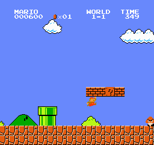 |

**Para discutir:** ¿qué se observa al terminar este intento? ¿Qué evidencia distingue un salto tardío, una repetición de acciones o un límite de decisiones? La causa específica requiere revisar los clips; la posición por sí sola no la identifica.

### Etapa 10: 150 min adicionales

Etapa `10_stage` · 150,0 minutos adicionales · 1.708.772 decisiones acumuladas.

[Evaluación completa en JSON](../../results/teaching_20260916/stages/10_stage/evaluation.json) · [Resumen del entrenamiento](../../results/teaching_20260916/training/10_stage/training_summary.json)

| Semilla | Máx. x | Última x | Recompensa nativa | Final del intento | Rachas | Mayor racha (decisiones) | Evidencia |
| ---: | ---: | ---: | ---: | --- | ---: | ---: | --- |
| 101 | 3.161 | 3.161 | 3.089,0 | bandera alcanzada | 0 | 10 | [comienzo](../../results/teaching_20260916/stages/10_stage/seed-101/beginning.gif) · [tramo final](../../results/teaching_20260916/stages/10_stage/seed-101/ending.gif) · [traza CSV](../../results/teaching_20260916/stages/10_stage/seed-101/trace.csv) · [último fotograma](../../results/teaching_20260916/stages/10_stage/seed-101/last-frame.png) |
| 202 | 3.161 | 3.161 | 3.089,0 | bandera alcanzada | 0 | 12 | [comienzo](../../results/teaching_20260916/stages/10_stage/seed-202/beginning.gif) · [tramo final](../../results/teaching_20260916/stages/10_stage/seed-202/ending.gif) · [traza CSV](../../results/teaching_20260916/stages/10_stage/seed-202/trace.csv) · [último fotograma](../../results/teaching_20260916/stages/10_stage/seed-202/last-frame.png) |
| 303 | 3.161 | 3.161 | 3.086,0 | bandera alcanzada | 0 | 7 | [comienzo](../../results/teaching_20260916/stages/10_stage/seed-303/beginning.gif) · [tramo final](../../results/teaching_20260916/stages/10_stage/seed-303/ending.gif) · [traza CSV](../../results/teaching_20260916/stages/10_stage/seed-303/trace.csv) · [último fotograma](../../results/teaching_20260916/stages/10_stage/seed-303/last-frame.png) |
| 404 | 3.161 | 3.161 | 3.078,0 | bandera alcanzada | 0 | 10 | [traza CSV](../../results/teaching_20260916/stages/10_stage/seed-404/trace.csv) |
| 505 | 3.161 | 3.161 | 3.091,0 | bandera alcanzada | 0 | 6 | [traza CSV](../../results/teaching_20260916/stages/10_stage/seed-505/trace.csv) |

| Comienzo, semilla 101, decisiones 1–150 | Tramo final, semilla 101, decisiones 235–309 |
| --- | --- |
|  | 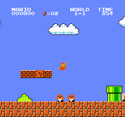 |

**Para discutir:** ¿qué se observa al terminar este intento? ¿Qué evidencia distingue un salto tardío, una repetición de acciones o un límite de decisiones? La causa específica requiere revisar los clips; la posición por sí sola no la identifica.

### Etapa 11: 163 min adicionales

Etapa `11_stage` · 162,8 minutos adicionales · 1.846.520 decisiones acumuladas.

[Evaluación completa en JSON](../../results/teaching_20260916/stages/11_stage/evaluation.json) · [Resumen del entrenamiento](../../results/teaching_20260916/training/11_stage/training_summary.json)

| Semilla | Máx. x | Última x | Recompensa nativa | Final del intento | Rachas | Mayor racha (decisiones) | Evidencia |
| ---: | ---: | ---: | ---: | --- | ---: | ---: | --- |
| 101 | 3.161 | 3.161 | 3.087,0 | bandera alcanzada | 0 | 7 | [comienzo](../../results/teaching_20260916/stages/11_stage/seed-101/beginning.gif) · [tramo final](../../results/teaching_20260916/stages/11_stage/seed-101/ending.gif) · [traza CSV](../../results/teaching_20260916/stages/11_stage/seed-101/trace.csv) · [último fotograma](../../results/teaching_20260916/stages/11_stage/seed-101/last-frame.png) |
| 202 | 3.161 | 3.161 | 3.087,0 | bandera alcanzada | 0 | 8 | [comienzo](../../results/teaching_20260916/stages/11_stage/seed-202/beginning.gif) · [tramo final](../../results/teaching_20260916/stages/11_stage/seed-202/ending.gif) · [traza CSV](../../results/teaching_20260916/stages/11_stage/seed-202/trace.csv) · [último fotograma](../../results/teaching_20260916/stages/11_stage/seed-202/last-frame.png) |
| 303 | 3.161 | 3.161 | 3.091,0 | bandera alcanzada | 0 | 3 | [comienzo](../../results/teaching_20260916/stages/11_stage/seed-303/beginning.gif) · [tramo final](../../results/teaching_20260916/stages/11_stage/seed-303/ending.gif) · [traza CSV](../../results/teaching_20260916/stages/11_stage/seed-303/trace.csv) · [último fotograma](../../results/teaching_20260916/stages/11_stage/seed-303/last-frame.png) |
| 404 | 3.161 | 3.161 | 3.088,0 | bandera alcanzada | 0 | 9 | [traza CSV](../../results/teaching_20260916/stages/11_stage/seed-404/trace.csv) |
| 505 | 3.161 | 3.161 | 3.087,0 | bandera alcanzada | 0 | 5 | [traza CSV](../../results/teaching_20260916/stages/11_stage/seed-505/trace.csv) |

| Comienzo, semilla 101, decisiones 1–150 | Tramo final, semilla 101, decisiones 245–319 |
| --- | --- |
|  | 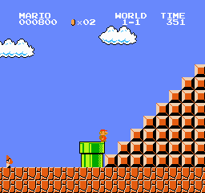 |

**Para discutir:** ¿qué se observa al terminar este intento? ¿Qué evidencia distingue un salto tardío, una repetición de acciones o un límite de decisiones? La causa específica requiere revisar los clips; la posición por sí sola no la identifica.

## Prueba final con semillas nuevas

Estas semillas se reservaron para el modelo final; no se mezclan con la curva de cinco pruebas repetidas ni se usan para elegir una etapa. Siguen siendo intentos del mismo World 1-1.

[Datos de la prueba final](../../results/teaching_20260916/final_audit/evaluation.json)

Posición máxima media: **2.818,6 px** · Mediana: **3.161,0 px** · Bandera: **7/10 pruebas**.

| Semilla | Máx. x | Bandera | Evidencia |
| ---: | ---: | ---: | --- |
| 1001 | 3.161 | sí | [comienzo](../../results/teaching_20260916/final_audit/seed-1001/beginning.gif) · [tramo final](../../results/teaching_20260916/final_audit/seed-1001/ending.gif) · [traza CSV](../../results/teaching_20260916/final_audit/seed-1001/trace.csv) |
| 1002 | 1.790 | no | [traza CSV](../../results/teaching_20260916/final_audit/seed-1002/trace.csv) |
| 1003 | 3.161 | sí | [traza CSV](../../results/teaching_20260916/final_audit/seed-1003/trace.csv) |
| 1004 | 3.161 | sí | [traza CSV](../../results/teaching_20260916/final_audit/seed-1004/trace.csv) |
| 1005 | 2.470 | no | [traza CSV](../../results/teaching_20260916/final_audit/seed-1005/trace.csv) |
| 1006 | 1.799 | no | [traza CSV](../../results/teaching_20260916/final_audit/seed-1006/trace.csv) |
| 1007 | 3.161 | sí | [traza CSV](../../results/teaching_20260916/final_audit/seed-1007/trace.csv) |
| 1008 | 3.161 | sí | [traza CSV](../../results/teaching_20260916/final_audit/seed-1008/trace.csv) |
| 1009 | 3.161 | sí | [traza CSV](../../results/teaching_20260916/final_audit/seed-1009/trace.csv) |
| 1010 | 3.161 | sí | [traza CSV](../../results/teaching_20260916/final_audit/seed-1010/trace.csv) |

## Material conservado y próximas sesiones

Los checkpoints publicados se descargan desde la [versión de modelos de esta sesión](https://github.com/sbardacosta-code/mario-rl/releases/tag/teaching_20260916). Son archivos separados del historial de código y requieren los permisos del repositorio. El enlace se incorpora al manifiesto después de confirmar la subida; consultar allí los archivos efectivamente publicados.

El repositorio conserva los reportes, las métricas y las muestras publicadas. Los logs detallados permanecen locales.

Último checkpoint local registrado: `results/teaching_20260916/training/11_stage/checkpoints/final.zip`.

[Informe de esta sesión](../../results/teaching_20260916/INFORME.md) · [Guía docente](GUIA_DOCENTE.md)

Sesiones conservadas:

- [teaching_20260916](../../results/teaching_20260916/INFORME.md)

Motivo de cierre registrado: `session_time_budget_reached`.

Para actualizar el mismo panel después de generar nuevas evaluaciones:

```sh
.venv/bin/python lesson_report.py --manifest results/teaching_20260916/manifest.json --repo-root .
```

La actualización del panel es local hasta que se confirma y se sube a GitHub. No ejecuta aprendizaje ni modifica los pesos del modelo.
