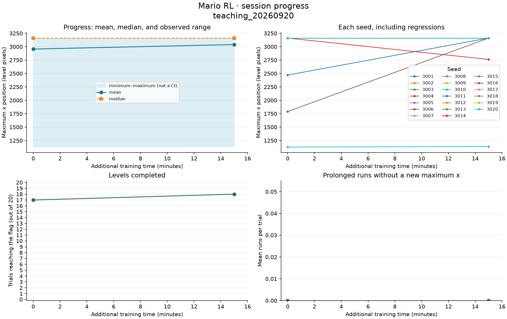
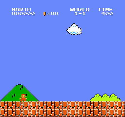
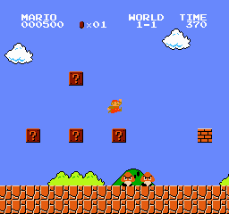
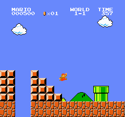

# Mario Learns: A Classroom Lab

Compare how a reinforcement learning policy changes across saved stages. This dashboard brings together measurements, observable errors, and clips from the same level; results may improve or worsen.

**Session:** `teaching_20260920` · **Status:** in progress · **Updated:** 2026-09-21 04:38 UTC.

[Teacher guide: a 35–45 minute lesson](GUIA_DOCENTE.md) · [Session data and configuration](../../results/teaching_20260920/manifest.json) · [Project and previous experiments](../../README.md) · [Failure diagnosis and playback comparison](../../results/teaching_20260920/diagnostics/README.md) · [Baseline and trained-model comparison](../../results/teaching_20260920/README.md)

This dashboard keeps the same path, `docs/aula/README.md`, when new sessions are published. Previous reports remain in their results folders. GitHub shows the most recently uploaded version; it does not stream local training live. Access depends on repository permissions.

## Using this in class

1. Watch the first stage and write down a prediction.
2. Compare the same seed at another stage: first the beginning, then the ending.
3. Check your visual impression against all 20 trials, the maximum position, and whether the flag was reached.
4. Describe an observable error and a hypothesis; look for evidence that distinguishes observation from explanation.

## What has happened so far

Between the first and last comparable stages, the mean maximum position **increased: 2,956.3 → 3,039.9 pixels**. The last stage reached the flag in **18 of 20 trials**. This describes these trials on the same level; it does not establish general performance or consistent improvement.



The horizontal axis measures **additional training during this session**. The decisions in the table are cumulative and may include earlier training. The band shows the minimum and maximum across trials; it is not a confidence interval. The x position is a coordinate within the level, not a completion percentage.

| Stage | Additional minutes | Cumulative decisions | Mean x | Median x | Min.–max. x | Flag |
| --- | ---: | ---: | ---: | ---: | ---: | ---: |
| Preserved baseline: 1,846,520 prior decisions | 0.0 | 1,846,520 | 2,956.3 | 3,161.0 | 1,128–3,161 | 17/20 |
| Stage 1: 15 additional min | 15.0 | 1,945,236 | 3,039.9 | 3,161.0 | 1,137–3,161 | 18/20 |

| Stage | Mean native reward | Runs without progress | Trials with a run |
| --- | ---: | ---: | ---: |
| Preserved baseline: 1,846,520 prior decisions | 2,882.3 | 0 | 0/20 |
| Stage 1: 15 additional min | 2,965.0 | 0 | 0/20 |

## How performance was measured

Planned seeds: **3001, 3002, 3003, 3004, 3005, 3006, 3007, 3008, 3009, 3010, 3011, 3012, 3013, 3014, 3015, 3016, 3017, 3018, 3019, 3020**. Sampling is reset for each trial; the seeds change the sampled actions in World 1-1, not the level layout. Evaluation uses frozen weights and native reward. The recorded training configuration is:

| Parameter | Value |
| --- | --- |
| Training reward multiplier | `0.01` |
| Learning rate | `0.0001` |
| Target KL threshold | `0.02` |
| Entropy coefficient | `0.01` |
| Training seed | `123` |
| Planned seconds per stage | `900` |

Evaluation mode: **stochastic (sampled actions)**. Limit per attempt: **3,000 decisions**. A run without progress is recorded after **120 decisions without increasing the previous maximum x**, as defined by the protocol. This can include jumps or movement within an area already traversed; it does not automatically detect walls or the cause of a death.

All recorded stages are shown, including regressions. Averages exclude evaluations that are incomplete or use a different protocol. Any partial attempt is documented in its JSON file. If a stage was selected for demonstration, that selection is labeled and does not replace the latest stage.

Clips are excerpts from the beginning and ending of each recorded trial; they may overlap in short episodes. Not every seed needs to have video: each row retains its trace and metrics. Exact durations and capture boundaries are recorded in `evaluation.json`.

## Stages and evidence

### Preserved baseline: 1,846,520 prior decisions

Stage `00_baseline` · 0.0 additional minutes · 1,846,520 cumulative decisions.

[Full evaluation JSON](../../results/teaching_20260920/stages/00_baseline/evaluation.json)

| Seed | Max. x | Last x | Native reward | How the attempt ended | Runs without progress | Longest run (decisions) | Evidence |
| ---: | ---: | ---: | ---: | --- | ---: | ---: | --- |
| 3001 | 2,471 | 2,471 | 2,380.0 | ended without reaching the flag; cause unknown | 0 | 4 | [beginning](../../results/teaching_20260920/stages/00_baseline/seed-3001/beginning.gif) · [ending](../../results/teaching_20260920/stages/00_baseline/seed-3001/ending.gif) · [CSV trace](../../results/teaching_20260920/stages/00_baseline/seed-3001/trace.csv) · [last frame](../../results/teaching_20260920/stages/00_baseline/seed-3001/last-frame.png) |
| 3002 | 3,161 | 3,161 | 3,087.0 | flag reached | 0 | 6 | [CSV trace](../../results/teaching_20260920/stages/00_baseline/seed-3002/trace.csv) |
| 3003 | 3,161 | 3,161 | 3,086.0 | flag reached | 0 | 18 | [CSV trace](../../results/teaching_20260920/stages/00_baseline/seed-3003/trace.csv) |
| 3004 | 3,161 | 3,161 | 3,090.0 | flag reached | 0 | 7 | [CSV trace](../../results/teaching_20260920/stages/00_baseline/seed-3004/trace.csv) |
| 3005 | 3,161 | 3,161 | 3,086.0 | flag reached | 0 | 10 | [CSV trace](../../results/teaching_20260920/stages/00_baseline/seed-3005/trace.csv) |
| 3006 | 1,790 | 1,790 | 1,700.0 | ended without reaching the flag; cause unknown | 0 | 2 | [CSV trace](../../results/teaching_20260920/stages/00_baseline/seed-3006/trace.csv) |
| 3007 | 3,161 | 3,161 | 3,091.0 | flag reached | 0 | 6 | [beginning](../../results/teaching_20260920/stages/00_baseline/seed-3007/beginning.gif) · [ending](../../results/teaching_20260920/stages/00_baseline/seed-3007/ending.gif) · [CSV trace](../../results/teaching_20260920/stages/00_baseline/seed-3007/trace.csv) · [last frame](../../results/teaching_20260920/stages/00_baseline/seed-3007/last-frame.png) |
| 3008 | 3,161 | 3,161 | 3,093.0 | flag reached | 0 | 3 | [CSV trace](../../results/teaching_20260920/stages/00_baseline/seed-3008/trace.csv) |
| 3009 | 3,161 | 3,161 | 3,080.0 | flag reached | 0 | 19 | [CSV trace](../../results/teaching_20260920/stages/00_baseline/seed-3009/trace.csv) |
| 3010 | 1,128 | 1,128 | 1,055.0 | ended without reaching the flag; cause unknown | 0 | 1 | [CSV trace](../../results/teaching_20260920/stages/00_baseline/seed-3010/trace.csv) |
| 3011 | 3,161 | 3,161 | 3,093.0 | flag reached | 0 | 1 | [CSV trace](../../results/teaching_20260920/stages/00_baseline/seed-3011/trace.csv) |
| 3012 | 3,161 | 3,161 | 3,091.0 | flag reached | 0 | 6 | [CSV trace](../../results/teaching_20260920/stages/00_baseline/seed-3012/trace.csv) |
| 3013 | 3,161 | 3,161 | 3,084.0 | flag reached | 0 | 9 | [CSV trace](../../results/teaching_20260920/stages/00_baseline/seed-3013/trace.csv) |
| 3014 | 3,161 | 3,161 | 3,090.0 | flag reached | 0 | 11 | [beginning](../../results/teaching_20260920/stages/00_baseline/seed-3014/beginning.gif) · [ending](../../results/teaching_20260920/stages/00_baseline/seed-3014/ending.gif) · [CSV trace](../../results/teaching_20260920/stages/00_baseline/seed-3014/trace.csv) · [last frame](../../results/teaching_20260920/stages/00_baseline/seed-3014/last-frame.png) |
| 3015 | 3,161 | 3,161 | 3,093.0 | flag reached | 0 | 3 | [CSV trace](../../results/teaching_20260920/stages/00_baseline/seed-3015/trace.csv) |
| 3016 | 3,161 | 3,161 | 3,092.0 | flag reached | 0 | 4 | [CSV trace](../../results/teaching_20260920/stages/00_baseline/seed-3016/trace.csv) |
| 3017 | 3,161 | 3,161 | 3,097.0 | flag reached | 0 | 1 | [CSV trace](../../results/teaching_20260920/stages/00_baseline/seed-3017/trace.csv) |
| 3018 | 3,161 | 3,161 | 3,084.0 | flag reached | 0 | 4 | [CSV trace](../../results/teaching_20260920/stages/00_baseline/seed-3018/trace.csv) |
| 3019 | 3,161 | 3,161 | 3,091.0 | flag reached | 0 | 10 | [CSV trace](../../results/teaching_20260920/stages/00_baseline/seed-3019/trace.csv) |
| 3020 | 3,161 | 3,161 | 3,084.0 | flag reached | 0 | 5 | [CSV trace](../../results/teaching_20260920/stages/00_baseline/seed-3020/trace.csv) |

| Beginning, seed 3001, decisions 1–227 | Ending, seed 3001, decisions 153–227 |
| --- | --- |
|  |  |

**Discuss:** What can you observe at the end of this attempt? What evidence distinguishes a late jump, repeated actions, or a decision limit? Identifying the specific cause requires reviewing the clips; position alone does not reveal it.

### Stage 1: 15 additional min

Stage `01_stage` · 15.0 additional minutes · 1,945,236 cumulative decisions.

[Full evaluation JSON](../../results/teaching_20260920/stages/01_stage/evaluation.json) · [Training summary](../../results/teaching_20260920/training/01_stage/training_summary.json)

| Seed | Max. x | Last x | Native reward | How the attempt ended | Runs without progress | Longest run (decisions) | Evidence |
| ---: | ---: | ---: | ---: | --- | ---: | ---: | --- |
| 3001 | 3,161 | 3,161 | 3,082.0 | flag reached | 0 | 8 | [beginning](../../results/teaching_20260920/stages/01_stage/seed-3001/beginning.gif) · [ending](../../results/teaching_20260920/stages/01_stage/seed-3001/ending.gif) · [CSV trace](../../results/teaching_20260920/stages/01_stage/seed-3001/trace.csv) · [last frame](../../results/teaching_20260920/stages/01_stage/seed-3001/last-frame.png) |
| 3002 | 3,161 | 3,161 | 3,090.0 | flag reached | 0 | 7 | [CSV trace](../../results/teaching_20260920/stages/01_stage/seed-3002/trace.csv) |
| 3003 | 3,161 | 3,161 | 3,088.0 | flag reached | 0 | 5 | [CSV trace](../../results/teaching_20260920/stages/01_stage/seed-3003/trace.csv) |
| 3004 | 2,763 | 2,763 | 2,677.0 | ended without reaching the flag; cause unknown | 0 | 1 | [CSV trace](../../results/teaching_20260920/stages/01_stage/seed-3004/trace.csv) |
| 3005 | 3,161 | 3,161 | 3,069.0 | flag reached | 0 | 7 | [CSV trace](../../results/teaching_20260920/stages/01_stage/seed-3005/trace.csv) |
| 3006 | 3,161 | 3,161 | 3,091.0 | flag reached | 0 | 4 | [CSV trace](../../results/teaching_20260920/stages/01_stage/seed-3006/trace.csv) |
| 3007 | 3,161 | 3,161 | 3,087.0 | flag reached | 0 | 9 | [beginning](../../results/teaching_20260920/stages/01_stage/seed-3007/beginning.gif) · [ending](../../results/teaching_20260920/stages/01_stage/seed-3007/ending.gif) · [CSV trace](../../results/teaching_20260920/stages/01_stage/seed-3007/trace.csv) · [last frame](../../results/teaching_20260920/stages/01_stage/seed-3007/last-frame.png) |
| 3008 | 3,161 | 3,161 | 3,088.0 | flag reached | 0 | 17 | [CSV trace](../../results/teaching_20260920/stages/01_stage/seed-3008/trace.csv) |
| 3009 | 3,161 | 3,161 | 3,091.0 | flag reached | 0 | 4 | [CSV trace](../../results/teaching_20260920/stages/01_stage/seed-3009/trace.csv) |
| 3010 | 1,137 | 1,137 | 1,063.0 | ended without reaching the flag; cause unknown | 0 | 1 | [CSV trace](../../results/teaching_20260920/stages/01_stage/seed-3010/trace.csv) |
| 3011 | 3,161 | 3,161 | 3,094.0 | flag reached | 0 | 5 | [CSV trace](../../results/teaching_20260920/stages/01_stage/seed-3011/trace.csv) |
| 3012 | 3,161 | 3,161 | 3,090.0 | flag reached | 0 | 17 | [CSV trace](../../results/teaching_20260920/stages/01_stage/seed-3012/trace.csv) |
| 3013 | 3,161 | 3,161 | 3,094.0 | flag reached | 0 | 4 | [CSV trace](../../results/teaching_20260920/stages/01_stage/seed-3013/trace.csv) |
| 3014 | 3,161 | 3,161 | 3,090.0 | flag reached | 0 | 8 | [beginning](../../results/teaching_20260920/stages/01_stage/seed-3014/beginning.gif) · [ending](../../results/teaching_20260920/stages/01_stage/seed-3014/ending.gif) · [CSV trace](../../results/teaching_20260920/stages/01_stage/seed-3014/trace.csv) · [last frame](../../results/teaching_20260920/stages/01_stage/seed-3014/last-frame.png) |
| 3015 | 3,161 | 3,161 | 3,093.0 | flag reached | 0 | 2 | [CSV trace](../../results/teaching_20260920/stages/01_stage/seed-3015/trace.csv) |
| 3016 | 3,161 | 3,161 | 3,091.0 | flag reached | 0 | 4 | [CSV trace](../../results/teaching_20260920/stages/01_stage/seed-3016/trace.csv) |
| 3017 | 3,161 | 3,161 | 3,087.0 | flag reached | 0 | 21 | [CSV trace](../../results/teaching_20260920/stages/01_stage/seed-3017/trace.csv) |
| 3018 | 3,161 | 3,161 | 3,064.0 | flag reached | 0 | 86 | [CSV trace](../../results/teaching_20260920/stages/01_stage/seed-3018/trace.csv) |
| 3019 | 3,161 | 3,161 | 3,089.0 | flag reached | 0 | 4 | [CSV trace](../../results/teaching_20260920/stages/01_stage/seed-3019/trace.csv) |
| 3020 | 3,161 | 3,161 | 3,082.0 | flag reached | 0 | 8 | [CSV trace](../../results/teaching_20260920/stages/01_stage/seed-3020/trace.csv) |

| Beginning, seed 3001, decisions 1–291 | Ending, seed 3001, decisions 217–291 |
| --- | --- |
|  |  |

**Discuss:** What can you observe at the end of this attempt? What evidence distinguishes a late jump, repeated actions, or a decision limit? Identifying the specific cause requires reviewing the clips; position alone does not reveal it.

## Saved materials and future sessions

Checkpoint `.zip` files are stored locally; this manifest does not yet confirm a published release of model weights. Downloading the code from GitHub does not include those models. The manifest records their paths for anyone with that local copy.

The repository retains the reports, metrics, and published samples. Detailed logs remain local.

Latest recorded local checkpoint: `results/teaching_20260920/training/01_stage/checkpoints/final.zip`.

[Session report](../../results/teaching_20260920/INFORME.md) · [Teacher guide](GUIA_DOCENTE.md)

Archived sessions:

- [teaching_20260916](../../results/teaching_20260916/INFORME.md)
- [teaching_20260920](../../results/teaching_20260920/INFORME.md)

To update this dashboard after generating new evaluations:

```sh
.venv/bin/python lesson_report.py --manifest results/teaching_20260920/manifest.json --repo-root .
```

The dashboard update remains local until it is committed and uploaded to GitHub. It does not run training or modify model weights.
