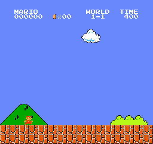
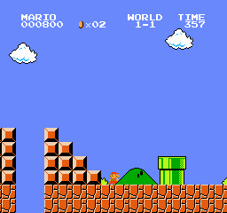
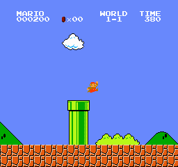
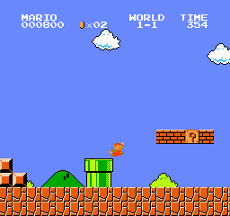
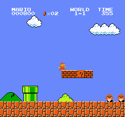
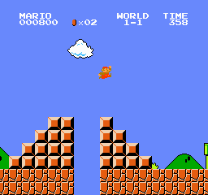

# Mario reliability check: 50 new attempts

**Result: 42/50 level completions (84%).** This is a new evaluation of the same saved September 16 model, with no further training.

Approximate 95% Wilson interval: **71.5%–91.7%**. This describes uncertainty for stochastic action sampling on World 1-1 from the same start. It does not measure performance across different levels or guarantee future outcomes.

[Classroom gallery](../../docs/aula/README.md) · [Predeclared experiment plan](experiment_plan.json) · [Full evaluation data](evaluation/evaluation.json) · [Verification](verification.json)

## Comparison with earlier evaluations

| Evaluation set | Completions | Role |
| --- | ---: | --- |
| Original five repeated stage seeds | 5/5 | Reused across training stages |
| Original ten new final-audit seeds | 7/10 | Separate final evaluation on September 16 |
| New seeds 2001–2050 | 42/50 | Larger follow-up evaluation on September 20 |

All three rows refer to the same final checkpoint. They are separate sets, not successive training improvements. No results were pooled and no checkpoint was selected using this new batch.

## What this tells the class

The policy can complete World 1-1, but 8 of these 50 attempts failed to reach the flag. It remains useful for teaching learning, variation, and failure. These results do not establish near-perfect reliability or skill on other levels.

The original 5/5 result came from only five trials. Testing more action sequences gives a more informative view of the remaining failures. A difference from 7/10 is not evidence that the model learned or deteriorated: the weights were unchanged.

Recommendation: preserve this model as the classroom baseline. If the next goal is more reliable completion, use a separately documented training experiment and reserve new evaluation seeds for its final assessment. Do not tune on these 50 seeds and then call them an untouched final test.

## Protocol and safeguards

- Frozen final checkpoint from `teaching_20260916/training/11_stage`; zero learning updates.
- World 1-1, the same initial state, stochastic policy actions, seeds 2001–2050.
- Five RIGHT_ONLY actions, four-frame action repeat, four stacked 84 × 84 grayscale observations, and a 3,000-decision episode cap.
- Seed choices alter sampled actions; they do not create new levels. Deterministic action selection was not assessed.
- Native rewards are reported. The training reward definition and weights were not changed.
- Beginning and ending clips were preselected for seeds 2001, 2011, 2021, 2031, and 2041. Every trial retains a full CSV trace.

Model SHA-256: `c2be01926a484cf3464a2bb7564a087ac535440361afa0a35bc8e5d07e7621c5`. All 50 planned attempts finished. Verified 14,532 CSV rows and 15 media files. Evaluation elapsed time: **67.7 seconds**.

Mean maximum x: **2,967.1 px** · Median maximum x: **3,161.0 px** · Mean native reward: **2,891.7**.

## Attempts that did not reach the flag

Positions identify where progress ended. They do not by themselves identify an enemy, missed jump, or other cause. The evaluator records an unknown cause for non-clearing termination.

| Seed | Furthest x | Ending | Evidence |
| ---: | ---: | --- | --- |
| 2005 | 2,762 | Ended without flag; cause unknown | [CSV trace](evaluation/seed-2005/trace.csv) |
| 2009 | 2,474 | Ended without flag; cause unknown | [CSV trace](evaluation/seed-2009/trace.csv) |
| 2011 | 1,793 | Ended without flag; cause unknown | [CSV trace](evaluation/seed-2011/trace.csv) · [beginning clip](evaluation/seed-2011/beginning.gif) · [ending clip](evaluation/seed-2011/ending.gif) |
| 2014 | 1,791 | Ended without flag; cause unknown | [CSV trace](evaluation/seed-2014/trace.csv) |
| 2018 | 2,472 | Ended without flag; cause unknown | [CSV trace](evaluation/seed-2018/trace.csv) |
| 2028 | 1,796 | Ended without flag; cause unknown | [CSV trace](evaluation/seed-2028/trace.csv) |
| 2033 | 710 | Ended without flag; cause unknown | [CSV trace](evaluation/seed-2033/trace.csv) |
| 2038 | 1,795 | Ended without flag; cause unknown | [CSV trace](evaluation/seed-2038/trace.csv) |

## Preselected gameplay samples

These five samples were chosen before seeing results. Clips show the first 150 and last 75 decisions; they may overlap in short attempts.

### Seed 2001: level completed

Maximum x: 3,161; 291 decisions. [CSV trace](evaluation/seed-2001/trace.csv) · [beginning clip](evaluation/seed-2001/beginning.gif) · [ending clip](evaluation/seed-2001/ending.gif)

| Beginning | Ending |
| --- | --- |
|  |  |

### Seed 2011: flag not reached

Maximum x: 1,793; 179 decisions. [CSV trace](evaluation/seed-2011/trace.csv) · [beginning clip](evaluation/seed-2011/beginning.gif) · [ending clip](evaluation/seed-2011/ending.gif)

| Beginning | Ending |
| --- | --- |
|  |  |

### Seed 2021: level completed

Maximum x: 3,161; 307 decisions. [CSV trace](evaluation/seed-2021/trace.csv) · [beginning clip](evaluation/seed-2021/beginning.gif) · [ending clip](evaluation/seed-2021/ending.gif)

| Beginning | Ending |
| --- | --- |
|  |  |

### Seed 2031: level completed

Maximum x: 3,161; 302 decisions. [CSV trace](evaluation/seed-2031/trace.csv) · [beginning clip](evaluation/seed-2031/beginning.gif) · [ending clip](evaluation/seed-2031/ending.gif)

| Beginning | Ending |
| --- | --- |
|  |  |

### Seed 2041: level completed

Maximum x: 3,161; 285 decisions. [CSV trace](evaluation/seed-2041/trace.csv) · [beginning clip](evaluation/seed-2041/beginning.gif) · [ending clip](evaluation/seed-2041/ending.gif)

| Beginning | Ending |
| --- | --- |
|  |  |

## All 50 attempts

| Seed | Flag reached | Furthest x | Native reward | Decisions | Evidence |
| ---: | --- | ---: | ---: | ---: | --- |
| 2001 | Yes | 3,161 | 3,093.0 | 291 | [CSV trace](evaluation/seed-2001/trace.csv) · [beginning clip](evaluation/seed-2001/beginning.gif) · [ending clip](evaluation/seed-2001/ending.gif) |
| 2002 | Yes | 3,161 | 3,095.0 | 278 | [CSV trace](evaluation/seed-2002/trace.csv) |
| 2003 | Yes | 3,161 | 3,094.0 | 285 | [CSV trace](evaluation/seed-2003/trace.csv) |
| 2004 | Yes | 3,161 | 3,090.0 | 296 | [CSV trace](evaluation/seed-2004/trace.csv) |
| 2005 | No | 2,762 | 2,673.0 | 247 | [CSV trace](evaluation/seed-2005/trace.csv) |
| 2006 | Yes | 3,161 | 3,093.0 | 283 | [CSV trace](evaluation/seed-2006/trace.csv) |
| 2007 | Yes | 3,161 | 3,093.0 | 282 | [CSV trace](evaluation/seed-2007/trace.csv) |
| 2008 | Yes | 3,161 | 3,092.0 | 291 | [CSV trace](evaluation/seed-2008/trace.csv) |
| 2009 | No | 2,474 | 2,393.0 | 217 | [CSV trace](evaluation/seed-2009/trace.csv) |
| 2010 | Yes | 3,161 | 3,087.0 | 312 | [CSV trace](evaluation/seed-2010/trace.csv) |
| 2011 | No | 1,793 | 1,712.0 | 179 | [CSV trace](evaluation/seed-2011/trace.csv) · [beginning clip](evaluation/seed-2011/beginning.gif) · [ending clip](evaluation/seed-2011/ending.gif) |
| 2012 | Yes | 3,161 | 3,075.0 | 343 | [CSV trace](evaluation/seed-2012/trace.csv) |
| 2013 | Yes | 3,161 | 3,088.0 | 311 | [CSV trace](evaluation/seed-2013/trace.csv) |
| 2014 | No | 1,791 | 1,701.0 | 171 | [CSV trace](evaluation/seed-2014/trace.csv) |
| 2015 | Yes | 3,161 | 3,095.0 | 280 | [CSV trace](evaluation/seed-2015/trace.csv) |
| 2016 | Yes | 3,161 | 3,092.0 | 296 | [CSV trace](evaluation/seed-2016/trace.csv) |
| 2017 | Yes | 3,161 | 3,090.0 | 303 | [CSV trace](evaluation/seed-2017/trace.csv) |
| 2018 | No | 2,472 | 2,321.0 | 529 | [CSV trace](evaluation/seed-2018/trace.csv) |
| 2019 | Yes | 3,161 | 3,091.0 | 292 | [CSV trace](evaluation/seed-2019/trace.csv) |
| 2020 | Yes | 3,161 | 3,091.0 | 281 | [CSV trace](evaluation/seed-2020/trace.csv) |
| 2021 | Yes | 3,161 | 3,090.0 | 307 | [CSV trace](evaluation/seed-2021/trace.csv) · [beginning clip](evaluation/seed-2021/beginning.gif) · [ending clip](evaluation/seed-2021/ending.gif) |
| 2022 | Yes | 3,161 | 3,087.0 | 316 | [CSV trace](evaluation/seed-2022/trace.csv) |
| 2023 | Yes | 3,161 | 3,072.0 | 355 | [CSV trace](evaluation/seed-2023/trace.csv) |
| 2024 | Yes | 3,161 | 3,067.0 | 384 | [CSV trace](evaluation/seed-2024/trace.csv) |
| 2025 | Yes | 3,161 | 3,091.0 | 303 | [CSV trace](evaluation/seed-2025/trace.csv) |
| 2026 | Yes | 3,161 | 3,094.0 | 290 | [CSV trace](evaluation/seed-2026/trace.csv) |
| 2027 | Yes | 3,161 | 3,090.0 | 300 | [CSV trace](evaluation/seed-2027/trace.csv) |
| 2028 | No | 1,796 | 1,714.0 | 170 | [CSV trace](evaluation/seed-2028/trace.csv) |
| 2029 | Yes | 3,161 | 3,095.0 | 280 | [CSV trace](evaluation/seed-2029/trace.csv) |
| 2030 | Yes | 3,161 | 3,085.0 | 317 | [CSV trace](evaluation/seed-2030/trace.csv) |
| 2031 | Yes | 3,161 | 3,090.0 | 302 | [CSV trace](evaluation/seed-2031/trace.csv) · [beginning clip](evaluation/seed-2031/beginning.gif) · [ending clip](evaluation/seed-2031/ending.gif) |
| 2032 | Yes | 3,161 | 3,095.0 | 276 | [CSV trace](evaluation/seed-2032/trace.csv) |
| 2033 | No | 710 | 638.0 | 73 | [CSV trace](evaluation/seed-2033/trace.csv) |
| 2034 | Yes | 3,161 | 3,091.0 | 299 | [CSV trace](evaluation/seed-2034/trace.csv) |
| 2035 | Yes | 3,161 | 3,085.0 | 325 | [CSV trace](evaluation/seed-2035/trace.csv) |
| 2036 | Yes | 3,161 | 3,080.0 | 341 | [CSV trace](evaluation/seed-2036/trace.csv) |
| 2037 | Yes | 3,161 | 3,091.0 | 289 | [CSV trace](evaluation/seed-2037/trace.csv) |
| 2038 | No | 1,795 | 1,709.0 | 154 | [CSV trace](evaluation/seed-2038/trace.csv) |
| 2039 | Yes | 3,161 | 3,090.0 | 304 | [CSV trace](evaluation/seed-2039/trace.csv) |
| 2040 | Yes | 3,161 | 3,085.0 | 321 | [CSV trace](evaluation/seed-2040/trace.csv) |
| 2041 | Yes | 3,161 | 3,093.0 | 285 | [CSV trace](evaluation/seed-2041/trace.csv) · [beginning clip](evaluation/seed-2041/beginning.gif) · [ending clip](evaluation/seed-2041/ending.gif) |
| 2042 | Yes | 3,161 | 3,089.0 | 301 | [CSV trace](evaluation/seed-2042/trace.csv) |
| 2043 | Yes | 3,161 | 3,089.0 | 302 | [CSV trace](evaluation/seed-2043/trace.csv) |
| 2044 | Yes | 3,161 | 3,087.0 | 316 | [CSV trace](evaluation/seed-2044/trace.csv) |
| 2045 | Yes | 3,161 | 3,088.0 | 308 | [CSV trace](evaluation/seed-2045/trace.csv) |
| 2046 | Yes | 3,161 | 3,088.0 | 315 | [CSV trace](evaluation/seed-2046/trace.csv) |
| 2047 | Yes | 3,161 | 3,091.0 | 285 | [CSV trace](evaluation/seed-2047/trace.csv) |
| 2048 | Yes | 3,161 | 3,085.0 | 318 | [CSV trace](evaluation/seed-2048/trace.csv) |
| 2049 | Yes | 3,161 | 3,087.0 | 319 | [CSV trace](evaluation/seed-2049/trace.csv) |
| 2050 | Yes | 3,161 | 3,089.0 | 310 | [CSV trace](evaluation/seed-2050/trace.csv) |

## Discussion prompts

- Why did five successful attempts not establish that Mario would always win?
- How can the same frozen policy produce different outcomes?
- Which claims come from the metrics, and which require inspecting a clip?
- What additional evidence would be needed before claiming it can play other levels?
