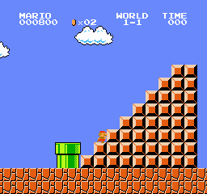

# Playback settings and repeated failures

**Finding:** choosing only the highest-probability action did not solve the problem. The original model stalled at a staircase until the game timer reached zero. The eight selected stochastic failures also reproduced exactly.

[Current experiment](../README.md) · [Permanent classroom gallery](../../../docs/aula/README.md) · [Diagnostic plan](plan.json) · [Verification](verification.json) · [Original 50-attempt results](../../reliability_20260920/README.md)

## What was tested

No weights or rewards were changed. The eight failure seeds were selected after viewing the earlier results. These are diagnostic replays, not eight new independent failures added to the completion estimate. All eight full CSV traces match their original traces byte for byte.

The deterministic comparison used seeds 5001, 5002, and 5003 with the same level and starting state. All three traces are identical: this is one trajectory reproduced three times, not an estimate from three independent conditions.

## Highest-probability playback: a staircase trap

Mario reaches maximum x=2,915, then makes 1,757 decisions without increasing that maximum. The trace ends at decision 2,005 with the in-game clock at zero. The late trace repeatedly selects `right+A` (right plus jump), and the captured image shows Mario against the staircase.

The visual and trace evidence support a stall followed by timeout. A useful hypothesis is that the policy needs a different button sequence to climb the staircase, potentially releasing and pressing jump again. This hypothesis was not tested by manually intervening, and it is not an automatic death-cause label from the emulator.

[Full deterministic playback](deterministic/seed-5001/beginning.gif) · [CSV trace](deterministic/seed-5001/trace.csv) · [All deterministic evaluation data](deterministic/evaluation.json)

Sampling occasionally picks a less likely move. The existing 42/50 result shows that this policy can finish under sampled actions, while the fixed highest-probability sequence failed here. Changing playback is not additional learning.

## What the eight failure replays show

The descriptions below are visual interpretations of recorded frames. The evaluator still stores `death_cause: unknown`; pixels and nearby objects do not expose an internal cause code. Full clips are retained so a teacher can challenge each interpretation.

| Seed | Furthest x | Observation and interpretation | Evidence |
| ---: | ---: | --- | --- |
| 2005 | 2,762 | Approaches a group of enemies on the ground; the last frame shows close overlap. Consistent with an enemy collision. | [Full clip](failure_replays/seed-2005/beginning.gif) · [Ending](failure_replays/seed-2005/ending.gif) · [Trace](failure_replays/seed-2005/trace.csv) |
| 2009 | 2,474 | Moves into the gap between two staircases and disappears below the visible playfield. Consistent with a failed gap crossing. | [Full clip](failure_replays/seed-2009/beginning.gif) · [Ending](failure_replays/seed-2009/ending.gif) · [Trace](failure_replays/seed-2009/trace.csv) |
| 2011 | 1,793 | Lands near a group of ground enemies; the ending shows Mario at their height and overlapping the group. Consistent with an enemy collision. | [Full clip](failure_replays/seed-2011/beginning.gif) · [Ending](failure_replays/seed-2011/ending.gif) · [Trace](failure_replays/seed-2011/trace.csv) |
| 2014 | 1,791 | Descends toward the same group of ground enemies; the final frame shows contact/overlap. Consistent with an enemy collision. | [Full clip](failure_replays/seed-2014/beginning.gif) · [Ending](failure_replays/seed-2014/ending.gif) · [Trace](failure_replays/seed-2014/trace.csv) |
| 2018 | 2,472 | Reaches the staircase gap and disappears below the visible playfield. Consistent with a failed gap crossing. | [Full clip](failure_replays/seed-2018/beginning.gif) · [Ending](failure_replays/seed-2018/ending.gif) · [Trace](failure_replays/seed-2018/trace.csv) |
| 2028 | 1,796 | Descends into the same group of ground enemies. Consistent with an enemy collision. | [Full clip](failure_replays/seed-2028/beginning.gif) · [Ending](failure_replays/seed-2028/ending.gif) · [Trace](failure_replays/seed-2028/trace.csv) |
| 2033 | 710 | The last frame shows Mario overlapping a ground enemy just before a pipe. Consistent with an enemy collision. | [Full clip](failure_replays/seed-2033/beginning.gif) · [Ending](failure_replays/seed-2033/ending.gif) · [Trace](failure_replays/seed-2033/trace.csv) |
| 2038 | 1,795 | Descends into the same group of ground enemies. Consistent with an enemy collision. | [Full clip](failure_replays/seed-2038/beginning.gif) · [Ending](failure_replays/seed-2038/ending.gif) · [Trace](failure_replays/seed-2038/trace.csv) |

Four endings cluster around x=1,791–1,796 near the same enemy group. Two occur around x=2,472–2,474 in the same staircase gap. This is useful diagnostic evidence; their selected nature prevents using these eight clips alone to estimate how frequently each problem occurs.

## The next controlled experiment

Continue from the preserved model for four 15-minute stages, with the same reward and hyperparameters. Reuse a separate set of 20 validation seeds to document stages and select one candidate. After selection, compare that candidate and the original baseline on the same 100 previously unused stochastic seeds. Training, sampling, and model selection are three different steps, and each is recorded separately.

The goal is to measure whether additional practice improves consistency. The experiment will retain every stage even if performance gets worse; it will not replace the baseline just because more time was spent training.

## Classroom discussion

- Why might always picking the most likely move perform worse than sampling?
- What is directly visible in a clip, and what is only a hypothesis?
- What would distinguish a jump-timing problem from a different cause?
- Why must the final evaluation use seeds that were not used to select the model?
