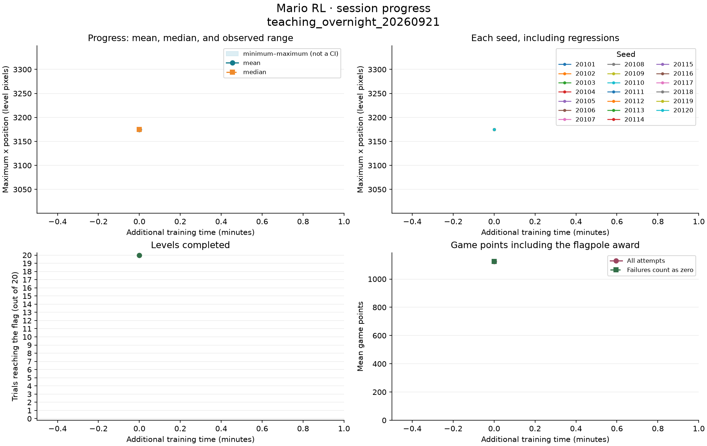
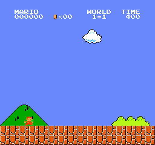
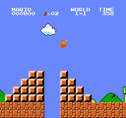

# Mario Learns: A Classroom Lab

Compare how a reinforcement learning policy changes across saved stages. This dashboard brings together measurements, observable errors, and clips from the same level; results may improve or worsen.

**Session:** `teaching_overnight_20260921` · **Status:** in progress · **Updated:** 2026-09-21 08:31 UTC.

[Teacher guide: a 35–45 minute lesson](../../docs/aula/GUIA_DOCENTE.md) · [Session data and configuration](manifest.json) · [Project and previous experiments](../../README.md) · [Baseline and trained-model comparison](README.md)

This dashboard keeps the same path, `docs/aula/README.md`, when new sessions are published. Previous reports remain in their results folders. GitHub shows the most recently uploaded version; it does not stream local training live. Access depends on repository permissions.

## Using this in class

1. Watch the first stage and write down a prediction.
2. Compare the same seed at another stage: first the beginning, then the ending.
3. Check your visual impression against all 20 trials, the maximum position, and whether the flag was reached.
4. Describe an observable error and a hypothesis; look for evidence that distinguishes observation from explanation.

## What has happened so far

The starting point has been evaluated. Another comparable stage is needed to measure change during this session.

## Current objective: more game points while still finishing

This session measures actual game points through the real flagpole award. Later timer and fireworks bonuses are excluded. A separately labeled bonus of 1,000 teaching points rewards each extra life. The bridge training mode retains some of the earlier native movement guidance; its weight and any rollback are documented per stage. Evaluation uses a fixed event-aware protocol.

| Stage | Actual points, all attempts | Actual points, failures = 0 | Game + teaching points, failures = 0 | Flag reached |
| --- | ---: | ---: | ---: | ---: |
| Preserved completion baseline | 1,125.0 | 1,125.0 | 1,125.0 | 20/20 |

[Score experiment, selection rule, and final comparison](README.md)



The horizontal axis measures **additional training during this session**. The decisions in the table are cumulative and may include earlier training. The band shows the minimum and maximum across trials; it is not a confidence interval. The x position is a coordinate within the level, not a completion percentage.

| Stage | Additional minutes | Cumulative decisions | Mean x | Median x | Min.–max. x | Flag |
| --- | ---: | ---: | ---: | ---: | ---: | ---: |
| Preserved completion baseline | 0.0 | 2,119,660 | 3,175.0 | 3,175.0 | 3,175–3,175 | 20/20 |

| Stage | Mean native reward | Runs without progress | Trials with a run |
| --- | ---: | ---: | ---: |
| Preserved completion baseline | 3,092.7 | 0 | 0/20 |

## How performance was measured

Planned seeds: **20101, 20102, 20103, 20104, 20105, 20106, 20107, 20108, 20109, 20110, 20111, 20112, 20113, 20114, 20115, 20116, 20117, 20118, 20119, 20120**. Sampling is reset for each trial; the seeds change the sampled actions in World 1-1, not the level layout. Evaluation uses frozen weights and records real points, extra-life credit, and native reward separately. The initial bridge settings below can change only under the predeclared stage rules; the experiment report lists each stage:

| Parameter | Value |
| --- | --- |
| Training reward multiplier | `1.0` |
| Learning rate | `2.5e-05` |
| Target KL threshold | `0.01` |
| Entropy coefficient | `0.003` |
| Training seed | `123` |
| Planned seconds per stage | `900` |

Evaluation mode: **stochastic (sampled actions)**. Limit per attempt: **3,000 decisions**. A run without progress is recorded after **120 decisions without increasing the previous maximum x**, as defined by the protocol. This can include jumps or movement within an area already traversed; it does not automatically detect walls or the cause of a death.

All recorded stages are shown, including regressions. Averages exclude evaluations that are incomplete or use a different protocol. Any partial attempt is documented in its JSON file. If a stage was selected for demonstration, that selection is labeled and does not replace the latest stage.

Clips can cover an entire trial or an excerpt from its beginning or ending. The capture boundaries and full-episode marker are recorded in `evaluation.json`. Not every seed needs video: each row retains its trace and metrics.

## Stages and evidence

### Preserved completion baseline

Stage `00_baseline` · 0.0 additional minutes · 2,119,660 decisions represented by this checkpoint (a rollback can restore an earlier counter).

[Full evaluation JSON](stages/00_baseline/evaluation.json)

| Seed | Max. x | Last x | Native reward | How the attempt ended | Runs without progress | Longest run (decisions) | Evidence |
| ---: | ---: | ---: | ---: | --- | ---: | ---: | --- |
| 20101 | 3,175 | 3,175 | 3,096.0 | flag reached | 0 | 1 | [beginning](stages/00_baseline/seed-20101/beginning.gif) · [ending](stages/00_baseline/seed-20101/ending.gif) · [CSV trace](stages/00_baseline/seed-20101/trace.csv) · [last frame](stages/00_baseline/seed-20101/last-frame.png) |
| 20102 | 3,175 | 3,175 | 3,095.0 | flag reached | 0 | 1 | [CSV trace](stages/00_baseline/seed-20102/trace.csv) |
| 20103 | 3,175 | 3,175 | 3,094.0 | flag reached | 0 | 10 | [CSV trace](stages/00_baseline/seed-20103/trace.csv) |
| 20104 | 3,175 | 3,175 | 3,091.0 | flag reached | 0 | 10 | [CSV trace](stages/00_baseline/seed-20104/trace.csv) |
| 20105 | 3,175 | 3,175 | 3,090.0 | flag reached | 0 | 26 | [CSV trace](stages/00_baseline/seed-20105/trace.csv) |
| 20106 | 3,175 | 3,175 | 3,092.0 | flag reached | 0 | 5 | [CSV trace](stages/00_baseline/seed-20106/trace.csv) |
| 20107 | 3,175 | 3,175 | 3,093.0 | flag reached | 0 | 16 | [CSV trace](stages/00_baseline/seed-20107/trace.csv) |
| 20108 | 3,175 | 3,175 | 3,089.0 | flag reached | 0 | 6 | [CSV trace](stages/00_baseline/seed-20108/trace.csv) |
| 20109 | 3,175 | 3,175 | 3,097.0 | flag reached | 0 | 1 | [CSV trace](stages/00_baseline/seed-20109/trace.csv) |
| 20110 | 3,175 | 3,175 | 3,091.0 | flag reached | 0 | 5 | [beginning](stages/00_baseline/seed-20110/beginning.gif) · [ending](stages/00_baseline/seed-20110/ending.gif) · [CSV trace](stages/00_baseline/seed-20110/trace.csv) · [last frame](stages/00_baseline/seed-20110/last-frame.png) |
| 20111 | 3,175 | 3,175 | 3,090.0 | flag reached | 0 | 7 | [CSV trace](stages/00_baseline/seed-20111/trace.csv) |
| 20112 | 3,175 | 3,175 | 3,090.0 | flag reached | 0 | 33 | [CSV trace](stages/00_baseline/seed-20112/trace.csv) |
| 20113 | 3,175 | 3,175 | 3,087.0 | flag reached | 0 | 9 | [CSV trace](stages/00_baseline/seed-20113/trace.csv) |
| 20114 | 3,175 | 3,175 | 3,096.0 | flag reached | 0 | 1 | [CSV trace](stages/00_baseline/seed-20114/trace.csv) |
| 20115 | 3,175 | 3,175 | 3,090.0 | flag reached | 0 | 9 | [CSV trace](stages/00_baseline/seed-20115/trace.csv) |
| 20116 | 3,175 | 3,175 | 3,092.0 | flag reached | 0 | 4 | [CSV trace](stages/00_baseline/seed-20116/trace.csv) |
| 20117 | 3,175 | 3,175 | 3,095.0 | flag reached | 0 | 8 | [CSV trace](stages/00_baseline/seed-20117/trace.csv) |
| 20118 | 3,175 | 3,175 | 3,096.0 | flag reached | 0 | 1 | [CSV trace](stages/00_baseline/seed-20118/trace.csv) |
| 20119 | 3,175 | 3,175 | 3,095.0 | flag reached | 0 | 1 | [CSV trace](stages/00_baseline/seed-20119/trace.csv) |
| 20120 | 3,175 | 3,175 | 3,095.0 | flag reached | 0 | 6 | [beginning](stages/00_baseline/seed-20120/beginning.gif) · [ending](stages/00_baseline/seed-20120/ending.gif) · [CSV trace](stages/00_baseline/seed-20120/trace.csv) · [last frame](stages/00_baseline/seed-20120/last-frame.png) |

| Beginning, seed 20101, decisions 1–269 | Ending, seed 20101, decisions 211–269 |
| --- | --- |
|  |  |

**Discuss:** What can you observe at the end of this attempt? What evidence distinguishes a late jump, repeated actions, or a decision limit? Identifying the specific cause requires reviewing the clips; position alone does not reveal it.

## Saved materials and future sessions

Checkpoint `.zip` files are stored locally; this manifest does not yet confirm a published release of model weights. Downloading the code from GitHub does not include those models. The manifest records their paths for anyone with that local copy.

The repository retains the reports, metrics, and published samples. Detailed logs remain local.

Latest recorded local checkpoint: `results/teaching_20260920/training/03_stage/checkpoints/final.zip`.

[Session report](INFORME.md) · [Teacher guide](../../docs/aula/GUIA_DOCENTE.md)

Archived sessions:

- [teaching_20260916](../teaching_20260916/INFORME.md)
- [teaching_20260920](../teaching_20260920/INFORME.md)
- [teaching_overnight_20260921](INFORME.md)
- [teaching_score_20260921](../teaching_score_20260921/INFORME.md)

To update this dashboard after generating new evaluations:

```sh
.venv/bin/python overnight_gallery.py --manifest results/teaching_overnight_20260921/manifest.json --repo-root .
```

The dashboard update remains local until it is committed and uploaded to GitHub. It does not run training or modify model weights.
